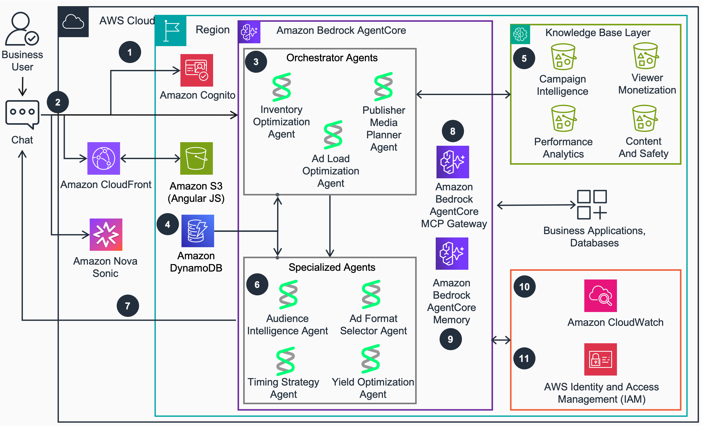
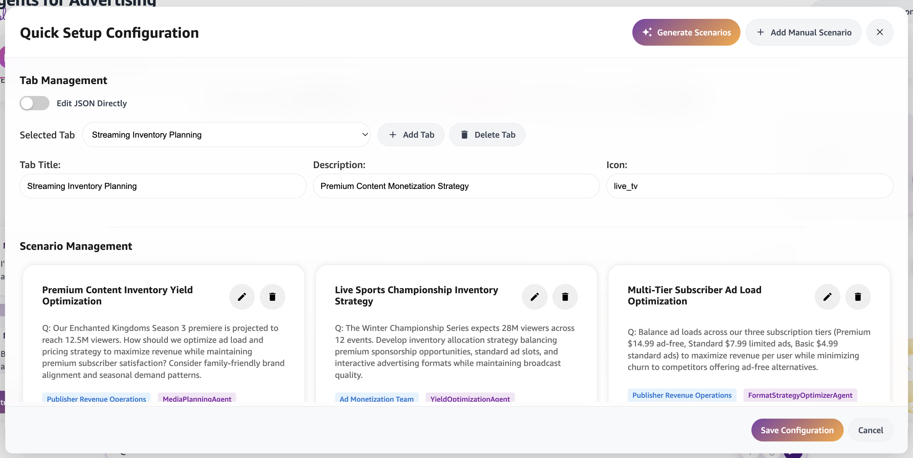
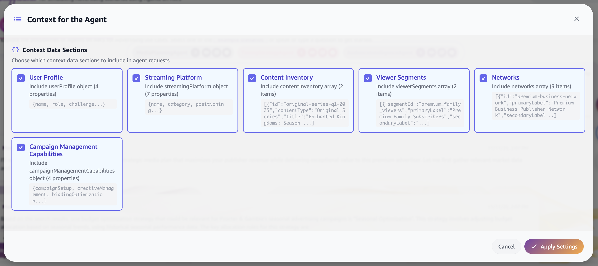
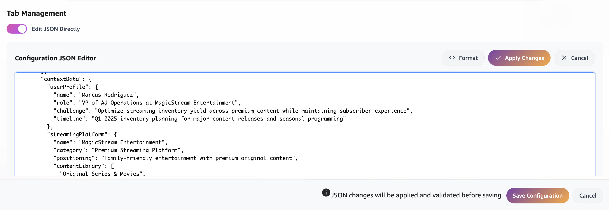
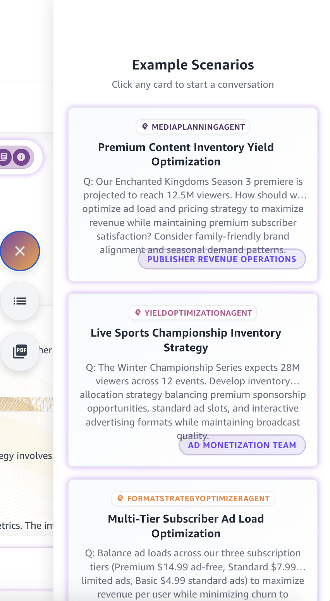
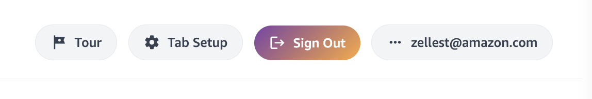

# Guidance for Advertising Agents

> **📋 v2 Architecture Update:** This version introduces significant architectural changes including DynamoDB-backed agent configuration, a Nova Sonic voice interface, a full CRUD agent management UI, and UI-generated visualizations. If you are upgrading from v1, please review [`docs/ARCHITECTURE_UPGRADE_V2.md`](docs/ARCHITECTURE_UPGRADE_V2.md) for a detailed breakdown of all changes.

This guidance demonstrates how to deploy a comprehensive agentic application for advertising workflows using Amazon Bedrock AgentCore. The solution showcases advanced multi-agent collaboration across the entire advertising value chain - from strategic media planning and audience targeting to real-time bid optimization and publisher revenue management.

## Table of Contents 

1. [Overview](#overview)
    - [Architecture](#architecture)
    - [Cost](#cost)
2. [Prerequisites](#prerequisites)
    - [Operating System](#operating-system)
    - [AWS Account Requirements](#aws-account-requirements)
    - [Service Limits](#service-limits)
    - [Supported Regions](#supported-regions)
3. [Deployment Steps](#deployment-steps)
4. [Deployment Validation](#deployment-validation)
5. [Running the Guidance](#running-the-guidance)
6. [Customizing the Demo](#customizing-the-demo)
7. [Next Steps](#next-steps)
8. [Cleanup](#cleanup)
9. [FAQ, known issues, additional considerations, and limitations](#faq-known-issues-additional-considerations-and-limitations)
10. [Notices](#notices)
11. [Authors](#authors)

## Overview 

This guidance demonstrates how to deploy a comprehensive agentic application for advertising workflows using Amazon Bedrock AgentCore. The solution showcases advanced multi-agent collaboration across the entire advertising value chain - from strategic media planning and audience targeting to real-time bid optimization and publisher revenue management.


**Advertising Industry Challenge**
Modern advertising requires intelligent coordination across multiple specialized domains:
- **Strategic Media Planning**: Campaign strategy, audience targeting, channel mix optimization, and campaign architecture
- **Tactical Bid Optimization**: Brand safety analysis, contextual targeting, bid optimization, and creative selection with AI image generation
- **Publisher Monetization**: Ad load optimization, inventory forecasting, campaign timing, and revenue format selection

This guidance provides an agentic solution that delivers:
- **Multi-Agent Application**: 21+ specialized AI agents with intelligent orchestration across 4 orchestrator agents and 17+ specialist agents
- **AgentCore Container Runtime**: All agents deployed using Amazon Bedrock AgentCore for enhanced capabilities including persistent memory, multi-agent coordination, and external API integration
- **Interactive Demo Interface**: Angular-based UI with real-time agent collaboration visualization, auto-generated charts and metrics, and a Nova Sonic voice interface
- **DynamoDB-Backed Agent Configuration**: Full CRUD management of agent configs (instructions, cards, visualization maps) through a dedicated UI, with DynamoDB-first storage and S3 fallback
- **Cost-Optimized Model Assignment**: Intelligent foundation model selection based on task complexity
- **Real-Time Creative Generation**: Amazon Nova Canvas integration for dynamic image creation
- **UI-Generated Visualizations**: Automatic detection and rendering of visualization-worthy data from agent responses (allocations, timelines, metrics, channels, and more)

### Architecture



**Key Architecture Components:**
- **4 Orchestrator Agents**: Media Planning, Campaign Optimization, Yield Optimization, and Inventory Optimization
- **17+ Specialist Agents**: Audience Intelligence, Audience Strategy, Timing Strategy, Format Strategy, Channel Mix, Campaign Architecture, Creative Selection, Ad Load Optimization, Media Plan Compiler, Weather Impact, Current Events, Contextual Analysis, Bid Optimization, Bid Simulator, Ad Format Selector, Events, and more
- **1 Knowledge Base**: With 1 data source covering campaign intelligence, audience strategy, brand and content safety, performance analytics, and inventory & yield optimization across multiple subdirectories
- **Shared Memory System**: Unified context across all agents enabling sophisticated cross-domain decision making
- **DynamoDB Agent Configuration**: Centralized agent config management (instructions, cards, visualization maps, global config) stored in DynamoDB with S3 fallback, enabling runtime CRUD operations from the UI
- **Agent Management UI**: Full create, edit, and delete interface for agent configurations — including model selection, instructions, visualization mappings, MCP server configs, and team assignments
- **Visualization Analyzer**: Automatic detection of visualization-worthy data in agent responses, rendering charts, allocations, timelines, and metrics in the UI
- **Nova Sonic Voice Interface**: Real-time speech-to-speech agent interaction using Amazon Nova Sonic with bidirectional streaming, tool-use routing, and turn management
- **External API Integration**: Real-time data from weather services, social media platforms, and competitive intelligence feeds
- **External A2A Agents**: Optionally deploy standalone agents (e.g. AdCreationAgent) to their own AgentCore runtime, invoked by the main agents over the A2A protocol with IAM, Cognito OAuth, or static Bearer Token inbound auth (see [`external-agents/`](external-agents/README.md))
- **IAB AAMP Marketplace**: Optional buyer and seller agents built on the IAB Tech Lab Agentic Ad Marketplace Protocol (AAMP) — deployed to their own AgentCore HTTP runtimes, authenticated inbound with a Cognito OAuth bearer (so they can be hosted in any account), and invoked by the AgencyAgent to drive a 5-step buy/sell flow in the AAMP Marketplace UI tab. Requires setting the AAMP inventory endpoint after deploy (see [section 8](#8-iab-aamp-marketplace-buyer--seller-agents) and [`docs/aamp-deployment-modes.md`](docs/aamp-deployment-modes.md))
- **Invocation Notification Hook**: Optionally configure any agent to fire a webhook notification (fire-and-forget, no response awaited) to an external endpoint every time it's invoked with a real user prompt — useful for driving an external display, log sink, or workflow trigger

### Cost 

_You are responsible for the cost of the AWS services used while running this Guidance. As of October 2025, the cost for running this Guidance with the default settings in the US East (N. Virginia) region is approximately $329.86 per month, assuming daily usage (see cost breakdown for details)._

The AgentCore deployment model provides cost advantages through:
- **Pay-per-use container runtime**: Only pay when agents are actively processing requests
- **Shared infrastructure**: Multiple agents share the same AgentCore runtime reducing overhead
- **Optimized model usage**: Intelligent foundation model assignment (Claude Sonnet 5 for orchestrators, with the option to switch specialists to Claude Haiku 4.5 for further cost savings)
- **Dynamic scaling**: Container-based agents scale automatically based on demand

_We recommend creating a [Budget](https://docs.aws.amazon.com/cost-management/latest/userguide/budgets-managing-costs.html) through [AWS Cost Explorer](https://aws.amazon.com/aws-cost-management/aws-cost-explorer/) to help manage costs. Prices are subject to change. For full details, refer to the pricing webpage for each AWS service used in this Guidance._

### Sample Cost Table 

The following table provides a sample cost breakdown for deploying this Guidance with the default parameters in the US East (N. Virginia) Region for one month.

| AWS service | Dimensions | Monthly Cost [USD] |
| ----------- | ------------ | ------------ |
| Amazon Bedrock Foundation Models | average 4 conversation turns per session, average 6 LLM prompts per conversation turn at $0.003 per prompt, average 1.5 sessions a day | $19.44 |
| Amazon Bedrock AgentCore Runtime | AgentCore Runtime, AgentCore Memory, average session duration of 45 minutes | $16.61 |
| Amazon S3 | Knowledge base data storage (5GB), generated content, static hosting | $2.50 |
| Amazon OpenSearch Serverless | Knowledge base, vector search operations | $219.00 |
| AWS Lambda | image generation | $1.50 |
| Amazon DynamoDB | Agent configuration storage (instructions, cards, visualization maps, global config), generated content details, session management | $70.31 |
| AWS CloudFront | Global content delivery for demo interface | $0.50 |
| **Total** | | **~$329.86** |

## Prerequisites 

### Operating System 

These deployment instructions are optimized to work on **Amazon Linux 2023 AMI**, **Ubuntu 20.04+**, and **macOS**. Deployment on other operating systems may require additional steps.

**Required packages:**
- **Python 3.10+** for deployment automation scripts (automatically managed by deployment script)
- **AWS CLI 2.32+** configured with appropriate permissions (required for bedrock-agentcore-control service)
- **Docker 20.10+** for AgentCore container builds (optional - only needed for custom agent development)
- **Node.js 22+** (LTS) for Angular demo UI (optional - only needed for UI development)
- **jq** for JSON processing (auto-installed by deployment script if missing)

**Install commands for Amazon Linux 2023:**
```bash
# Update system
sudo yum update -y

# Install Python 3.10+ (usually pre-installed)
sudo yum install -y python3 python3-pip python3-venv

# Install AWS CLI v2
curl "https://awscli.amazonaws.com/awscli-exe-linux-x86_64.zip" -o "awscliv2.zip"
unzip awscliv2.zip
sudo ./aws/install

# Install Docker (optional - for custom agent development)
sudo yum install -y docker
sudo systemctl start docker
sudo systemctl enable docker
sudo usermod -a -G docker $USER

# Install Node.js (optional - for UI development)
curl -fsSL https://rpm.nodesource.com/setup_22.x | sudo bash -
sudo yum install -y nodejs
```

**Install commands for Ubuntu:**
```bash
# Update system
sudo apt update && sudo apt upgrade -y

# Install Python 3.10+ and venv
sudo apt install -y python3 python3-pip python3-venv

# Install AWS CLI v2
curl "https://awscli.amazonaws.com/awscli-exe-linux-x86_64.zip" -o "awscliv2.zip"
unzip awscliv2.zip
sudo ./aws/install

# Install Docker (optional)
sudo apt install -y docker.io
sudo systemctl start docker
sudo systemctl enable docker
sudo usermod -a -G docker $USER

# Install Node.js (optional)
curl -fsSL https://deb.nodesource.com/setup_22.x | sudo -E bash -
sudo apt install -y nodejs
```

**Install commands for macOS:**
```bash
# Install Homebrew if not already installed
/bin/bash -c "$(curl -fsSL https://raw.githubusercontent.com/Homebrew/install/HEAD/install.sh)"

# Install required packages
brew install python@3.12 awscli jq

# Install Docker Desktop (optional)
brew install --cask docker

# Install Node.js (optional)
brew install node@22
```

### AWS Account Requirements

This deployment requires the following AWS account setup:

**Required AWS Services:**
- **Amazon Bedrock AgentCore** runtime enabled in your region
- **Amazon Bedrock Foundation Models** access (Claude Sonnet 5, Claude Haiku 4.5, Nova Canvas)
- **Amazon Bedrock Knowledge Bases** for vector search capabilities
- **Amazon S3** for data storage, static hosting, and generated content
- **Amazon OpenSearch Serverless** for knowledge base vector search
- **AWS Lambda** for action groups and configuration management
- **Amazon DynamoDB** for configuration data and session management
- **Amazon ECR** for container image storage
- **AWS CloudFront** for global content delivery
- **AWS Cognito** for user authentication

**Required IAM Permissions:**
The deployment user/role needs comprehensive permissions. Here's the minimum required policy:

```json
{
    "Version": "2012-10-17",
    "Statement": [
        {
            "Effect": "Allow",
            "Action": [
                "bedrock:*",
                "bedrock-agent:*",
                "bedrock-agentcore:*",
                "s3:*",
                "opensearch:*",
                "lambda:*",
                "dynamodb:*",
                "ecr:*",
                "cloudfront:*",
                "cognito-idp:*",
                "iam:CreateRole",
                "iam:DeleteRole",
                "iam:AttachRolePolicy",
                "iam:DetachRolePolicy",
                "iam:PassRole",
                "iam:GetRole",
                "iam:ListRolePolicies",
                "iam:ListAttachedRolePolicies",
                "cloudformation:*",
                "ssm:GetParameter",
                "ssm:PutParameter",
                "ssm:DeleteParameter"
            ],
            "Resource": "*"
        }
    ]
}

```

### Service Limits

**Critical service limits that may require increases:**
- **Amazon Bedrock AgentCore**: Default limit of 10 concurrent containers per region (may need increase for large deployments)
- **Amazon Bedrock Foundation Models**: 
  - Claude Sonnet 5: 40,000 tokens/minute (recommended for orchestrator and specialist agents)
  - Claude Haiku 4.5: 40,000 tokens/minute (optional lower-cost alternative for specialist agents)
  - Nova Canvas: 5 images/minute (for creative generation)
- **Amazon OpenSearch Serverless**: Default limit of 50 collections per account
- **AWS Lambda**: Concurrent execution limit (default 1,000)
- **Amazon S3**: No specific limits for this use case
- **Amazon DynamoDB**: Default limits are sufficient for this guidance

**To request limit increases:**
1. Navigate to [AWS Service Quotas](https://console.aws.amazon.com/servicequotas/)
2. Search for the specific service and quota
3. Submit increase request with business justification
4. For Bedrock model access, use the Bedrock console → Model access page

### Supported Regions

This Guidance is optimized for regions with full Amazon Bedrock AgentCore support:
- **US East (N. Virginia)** - us-east-1 (Recommended - most comprehensive model availability)
- **US West (Oregon)** - us-east-1 (Full AgentCore and model support)
- **Europe (Ireland)** - eu-west-1 (AgentCore available, check model availability)

**Important Notes:**
- **AgentCore Availability**: AgentCore runtime availability varies by region. The deployment script automatically handles region-specific configurations.
- **Model Availability**: Foundation model availability (Claude, Nova) varies by region. Ensure your target region supports the required models.
- **Default Configuration**: The deployment script defaults to `us-east-1` but can be configured for any supported region.

**To check current regional support:**
- Amazon Bedrock AgentCore: Check the [Amazon Bedrock User Guide](https://docs.aws.amazon.com/bedrock/latest/userguide/bedrock-regions.html)
- Foundation Models: Check model availability in the Bedrock console for your target region

## Deployment Steps 

The deployment process uses a single comprehensive script that handles all infrastructure, AgentCore containers, knowledge bases, and UI configuration automatically in 11 phases:

1. **Phase 1**: Check and adjust AWS service quotas
2. **Phase 2**: Deploy infrastructure (Core: S3, OpenSearch, Cognito; Services: Lambda, DynamoDB)
3. **Phase 3**: Deploy Lambda functions and migrate visualization data
4. **Phase 4**: Deploy knowledge bases with organized data sources
5. **Phase 5**: Sync data sources (start ingestion jobs)
6. **Phase 6**: Deploy AdCP MCP Gateway for agent collaboration
7. **Phase 7**: Upload agent configurations to S3
8. **Phase 8**: Upload agent configurations to DynamoDB
9. **Phase 9**: Deploy AgentCore agents
10. **Phase 10**: Generate UI configuration
11. **Phase 11**: Warm up agent runtimes
12. **Phase 12**: Deploy the IAB AAMP buyer & seller agents and wire their runtime ARNs + authentication into the config. The IAB source is pulled at deploy time — cloned from the upstream repos at `--aamp-branch` (default `main`), or taken from your own checkouts with `--local-aamp` (see [section 8](#8-iab-aamp-marketplace-buyer--seller-agents)). A failure here logs a warning and leaves the rest of the deployment intact

### Prerequisites Setup

#### 1. **Clone the repository**
```bash
git clone <repository-url>
cd <repository-name>
```

#### 2. **Configure AWS credentials**
```bash
# Configure a new AWS profile
aws configure --profile rtbag
```

  You'll be prompted for:
  - AWS Access Key ID
  - AWS Secret Access Key
  - Default region (e.g., us-east-1)
  - Default output format (json recommended)

**Option 1: Configure named profile**
```bash
# Option 1: Configure named profile (recommended)
aws configure --profile agnts4ad
# Enter your AWS Access Key ID, Secret Access Key, and preferred region (us-east-1)
```
**Option 2: Configure named profile**
```bash
# Option 2: Configure default profile
aws configure
# Enter your AWS Access Key ID, Secret Access Key, and preferred region
```

#### 3. **Verify AWS access**
```bash
# Test with named profile
aws sts get-caller-identity --profile agnts4ad

# Test with default profile (if using default)
aws sts get-caller-identity
```

#### 4. **Start Docker daemon**

Ensure Docker is running. If it isn't, you can use the below commands to start it.

  **On macOS (if using Docker Desktop)**
  ```bash
  # Start Docker Desktop application, or:
  open -a Docker

  # Verify Docker is running
  docker --version
  docker info
  ```

  **On Linux (Amazon Linux, Ubuntu)**
  ```bash
  sudo systemctl start docker
  sudo systemctl enable docker

  # Verify Docker is running
  docker --version
  docker info
  ```

**Note:** The deployment script builds and pushes the AgentCore container image to Amazon ECR, which requires Docker to be running.

### Solution deployment
#### 5. **Deploy all components**

Execute the following command with the appropriate variables:

```bash
# Deploy with required configurations. REVIEW and UPDATE the variables as needed
./scripts/deploy-ecosystem.sh \
  --stack-prefix a4a \
  --region us-east-1 \
  --profile agnts4ad \
  --demo-email user@example.com \
  --skip-confirmations true
```

The deployment script automatically handles:
- **Phase 1**: Check and adjust AWS service quotas
- **Phase 2**: Deploy infrastructure (Core: S3, OpenSearch, Cognito; Services: Lambda, DynamoDB)
- **Phase 3**: Deploy Lambda functions and migrate visualization data
- **Phase 4**: Deploy knowledge bases with organized data sources
- **Phase 5**: Sync data sources (start ingestion jobs)
- **Phase 6**: Deploy AdCP MCP Gateway for agent collaboration
- **Phase 7**: Upload agent configurations to S3
- **Phase 8**: Upload agent configurations to DynamoDB
- **Phase 9**: Deploy AgentCore agents
- **Phase 10**: Generate UI configuration
- **Phase 11**: Warm up agent runtimes
- **Phase 12**: Deploy IAB AAMP buyer & seller agents — source is cloned from the upstream IAB repos at `--aamp-branch` (default `main`), or supplied with `--local-aamp` (see [section 8](#8-iab-aamp-marketplace-buyer--seller-agents))

If you are partially through the deployment process and want to recover from an error, use below configurations for the deployment script so that it handles idempotency. You can find the unique Id from a config file that the script creates during the initial run, ex: `.unique-id-a4a-us-east-1`. The name of the file depends on stack-prefix and region.

```bash
# ReDeploy with required configurations. REVIEW and UPDATE the variables as needed. Refer to list below for resume-at phase description
# Phase 1: Check and adjust AWS service quotas
# Phase 2: Deploy infrastructure (Core: S3, OpenSearch, Cognito; Services: Lambda, DynamoDB)
# Phase 3: Deploy Lambda functions and migrate visualization data
# Phase 4: Deploy knowledge bases with organized data sources
# Phase 5: Sync data sources (start ingestion jobs)
# Phase 6: Deploy AdCP MCP Gateway for agent collaboration
# Phase 7: Upload agent configurations to S3
# Phase 8: Upload agent configurations to DynamoDB
# Phase 9: Deploy AgentCore agents
# Phase 10: Generate UI configuration
# Phase 11: Warm up agent runtimes
# Phase 12: Deploy IAB AAMP buyer & seller agents (clones the upstream IAB repos at --aamp-branch, default main; or use --local-aamp)

./scripts/deploy-ecosystem.sh \
  --stack-prefix a4a \
  --region us-east-1 \
  --profile agnts4ad \
  --demo-email user@example.com \
  --unique-id abc123 \
  --resume-at 5 \ 
  --skip-confirmations true
```

**(Optional) To update an AgentCore agent in isolation**

```bash
# Navigate to AgentCore deployment directory
cd agentcore/deployment

# Deploy specific agent
# The stack has a default agent called AdFabricAgent that loads the necessary agent's configuration in depending on the invocation's prompt. You may add more agents as needs become more divergent
./build_and_deploy.sh AdFabricAgent
```

### Get Access Information
#### 6. **From deployment outputs**
Your script will conclude with details about the URL for the Angular UI, as well as the temporary password for the demo user. You may also have received an email with the temporary credentials. If you need this in the future, you can execute the commands below. Alternatively, you can retrieve them from the CloudFormation console manually.

```bash
# Get CloudFront URL
aws cloudformation describe-stacks \
  --stack-name a4a-infrastructure-core \
  --region us-east-1 \
  --query 'Stacks[0].Outputs[?OutputKey==`UIUrl`].OutputValue' \
  --output text \
  --profile agnts4ad

# Get demo user credentials
aws cloudformation describe-stacks \
  --stack-name a4a-infrastructure-core \
  --region us-east-1 \
  --query 'Stacks[0].Outputs[?OutputKey==`DemoUserEmail`].OutputValue' \
  --output text \
  --profile agnts4ad

aws cloudformation describe-stacks \
  --stack-name a4a-infrastructure-core \
  --region us-east-1 \
  --query 'Stacks[0].Outputs[?OutputKey==`DemoUserPassword`].OutputValue' \
  --output text \
  --profile agnts4ad
```

## Deployment Validation 

**Validate successful deployment:**

1. **Check CloudFormation stacks**
   - Open AWS CloudFormation console in your deployment region
   - Verify stacks with names starting with `{stack-prefix}-infrastructure-*` show `CREATE_COMPLETE` status
   - Confirm AgentCore agent stacks are deployed successfully

2. **Validate AgentCore container deployment**
```bash
# List ECR repositories for AgentCore containers
aws ecr describe-repositories --region us-east-1 --profile agnts4ad | grep agentcore

# Check AgentCore runtime status
aws bedrock-agentcore-control list-agent-runtimes --region us-east-1 --profile agnts4ad
```

3. **Verify knowledge base**
```bash
# List deployed knowledge bases
aws bedrock-agent list-knowledge-bases --region us-east-1 --profile agnts4ad

# Check knowledge base status
aws bedrock-agent list-knowledge-bases \
  --region us-east-1 \
  --profile agnts4ad \
  --query 'knowledgeBaseSummaries[*].[name,status]' \
  --output table
```

4. **Verify UI deployment**
```bash
# Check CloudFront distribution status
aws cloudformation describe-stacks \
  --stack-name a4a-infrastructure-core \
  --region us-east-1 \
  --profile agnts4ad \
  --query 'Stacks[0].Outputs[?OutputKey==`UIUrl`].OutputValue' \
  --output text

# Verify demo user creation
aws cloudformation describe-stacks \
  --stack-name a4a-infrastructure-core \
  --region us-east-1 \
  --profile agnts4ad \
  --query 'Stacks[0].Outputs[?OutputKey==`DemoUserEmail`].OutputValue' \
  --output text
```
### Test the solution
Navigate to the user interface deployed to CloudFront, and type in "@MediaPlannerAgent, help me optimize my plan."

#### 1. Open the application
  - Open the CloudFront URL in your browser (e.g., `https://d1234567890abc.cloudfront.net`)
  - Log in using the demo credentials from above
  - **Note**: You will be prompted to change the temporary password on first login

#### 2. Navigate the interface
  - Start typing @ in the input text box at the bottom. You should see multiple agent types, including:
    - Media Planning Agent
    - Campaign Optimization Agent
    - Yield Optimization Agent
    - Inventory Optimization Agent

#### 3. Test Agent Interactions
- Each tab will have example contextual data that is appended to the user's prompt. To opt out of appending certain data, click on the context button (the list icon below the scenarios button) and uncheck specific sections of JSON content. This content can also be configured via the Tab Config view, which you will see on hover over the user's name in the top right corner.

  **Using Pre-populated Scenarios:**
  Each agent tab includes sample scenarios on the left sidebar. You can click on any of these to submit a test prompt.

  **Using Example Questions**
  For the below, type "@" to reveal agent selections for the agents below:

  *Media Planning Agent Scenarios:*
  - "Develop strategic media plan for Q4 holiday season from publisher perspective"
  - "Optimize inventory utilization and format mix for maximum yield"
  - "Analyze advertiser-publisher value alignment for automotive campaign"

  *Campaign Optimization Agent Scenarios:*
  - "Create integrated campaign strategy for product launch with $1M budget"
  - "Develop brand repositioning campaign targeting younger audience"
  - "Balance brand awareness and performance objectives for e-commerce campaign"

  *Yield Optimization Agent Scenarios:*
  - "Optimize yield for premium video inventory - current $12 CPM, target $18 CPM"
  - "Analyze competitive yield positioning and recommend pricing strategies"
  - "Develop seasonal yield optimization strategy for holiday shopping period"

  *Inventory Optimization Agent Scenarios:*
  - "Forecast inventory availability for Q1 2025 across all formats"
  - "Identify premium inventory packaging opportunities for luxury advertisers"
  - "Optimize inventory utilization and fill rate improvement strategies"

#### 4. Expected Response Features

  **Multi-Agent Orchestration:**
  - **Orchestrator agents** coordinate with **specialist agents** for comprehensive responses
  - **Parallel processing** of multiple specialist insights
  - **Synthesized recommendations** combining multiple perspectives

  **Advanced Capabilities:**
  - **Shared Memory Context**: Conversation history maintained across agent interactions
  - **Real-time Creative Generation**: Nova Canvas integration for dynamic image creation
  - **External API Integration**: Weather and social media data incorporated into responses
  - **Custom Business Logic**: Advanced algorithms for media mix modeling and yield optimization
  - **Visualization Generation**: The Visualization Analyzer automatically detects visualization-worthy data in agent responses and renders charts, allocations, timelines, channel breakdowns, and metrics dashboards in the UI
  - **Nova Sonic Voice Interface**: Real-time speech-to-speech interaction — speak to agents and hear responses via Amazon Nova Sonic with bidirectional streaming and intelligent agent routing
  - **Agent Management UI**: Create, edit, and delete agent configurations directly from the browser — changes persist to DynamoDB immediately

#### 5. Monitor Performance

**Using AgentCore Observability Dashboard:**

Amazon Bedrock AgentCore provides built-in observability features that give you real-time insights into agent performance, invocations, and system health.

**Access the Observability Dashboard:**
1. Navigate to the [Amazon Bedrock AgentCore Console](https://console.aws.amazon.com/bedrock-agentcore/)
2. Click on "Agent Runtime" to view your deployed agents
3. Select your agent runtime (e.g., "AdFabricAgent") to view its details
5. Click on the "Observability" tab to access the dashboard

**Dashboard Features:**
- **Invocation Metrics**: Real-time view of agent invocations, success rates, and error counts
- **Latency Tracking**: P50, P90, and P99 latency metrics for agent responses
- **Token Usage**: Monitor input/output tokens and associated costs
- **Error Analysis**: Detailed error logs and failure patterns
- **Agent Collaboration**: Visualize multi-agent interactions and orchestration flows
- **Memory Usage**: Track shared memory operations and context retention

**Using AWS CloudWatch (Advanced):**
```bash
# View AgentCore metrics
aws logs describe-log-groups \
  --log-group-name-prefix "/aws/bedrock/agentcore" \
  --region us-east-1 \
  --profile agnts4ad

# Monitor agent invocations
aws cloudwatch get-metric-statistics \
  --namespace AWS/Bedrock \
  --metric-name InvocationCount \
  --dimensions Name=AgentId,Value=<agent-id> \
  --start-time 2025-01-01T00:00:00Z \
  --end-time 2025-01-01T23:59:59Z \
  --period 3600 \
  --statistics Sum \
  --region us-east-1 \
  --profile agnts4ad

# View agent runtime logs
aws logs tail /aws/bedrock/agentcore/<agent-runtime-id> \
  --follow \
  --region us-east-1 \
  --profile agnts4ad
```

**Set Up CloudWatch Alarms:**
```bash
# Create alarm for high error rates
aws cloudwatch put-metric-alarm \
  --alarm-name "AgentCore-HighErrorRate" \
  --alarm-description "Alert when agent error rate exceeds 5%" \
  --metric-name ErrorRate \
  --namespace AWS/Bedrock/AgentCore \
  --statistic Average \
  --period 300 \
  --threshold 5 \
  --comparison-operator GreaterThanThreshold \
  --evaluation-periods 2 \
  --region us-east-1 \
  --profile agnts4ad
```

#### 6. Create Additional Users

```bash
# Get User Pool ID
USER_POOL_ID=$(aws cloudformation describe-stacks \
  --stack-name a4a-infrastructure-core \
  --region us-east-1 \
  --profile agnts4ad \
  --query 'Stacks[0].Outputs[?OutputKey==`UserPoolId`].OutputValue' \
  --output text)

# Create additional Cognito user
aws cognito-idp admin-create-user \
  --user-pool-id $USER_POOL_ID \
  --username newuser@example.com \
  --user-attributes Name=email,Value=newuser@example.com \
  --temporary-password TempPass123! \
  --message-action SUPPRESS \
  --region us-east-1 \
  --profile agnts4ad
```

#### 7. Test Advanced Features

**Test Shared Memory:**
1. Start conversation with Media Planning agent
2. Switch to Campaign Optimization agent in same session
3. Verify context continuity across agent interactions
4. Confirm shared memory maintains conversation state

**Test Creative Generation:**
- Ask the CreativeSelectionAgent to "generate a creative concept" or "create visual examples"
- Verify Nova Canvas integration produces relevant images
- Check that generated images appear in the UI with proper thumbnails

**Test External API Integration:**
- Ask about weather impact on campaigns
- Request social sentiment analysis
- Verify real-time data integration in responses

## Customizing the Demo

**Personalize and extend the demo application to fit your specific needs:**

### 1. Agent Configuration

  **Understanding Agent Architecture:**
  The demo includes multiple specialized agents that work together:
  - **Orchestrator Agents**: MediaPlanningAgent, CampaignOptimizationAgent, YieldOptimizationAgent, InventoryOptimizationAgent
  - **Specialist Agents**: AudienceIntelligenceAgent, TimingStrategyAgent, FormatStrategyOptimizerAgent, ChannelMixOptimizationAgent, CampaignArchitectureAgent, CreativeSelectionAgent, and more

  **Agent Management UI:**
  The demo includes a full CRUD interface for managing agent configurations directly from the browser. Access it via the user menu in the top-right corner. From the UI you can:
  - Create new agents with custom instructions, model configs, and visualization mappings
  - Edit existing agent properties: display name, team, description, tool agents, model config, instructions, color, MCP servers
  - Delete agents
  - Changes are persisted to DynamoDB and take effect on the next agent invocation

  **Modify Agent Instructions:**
  Agent behavior is controlled by instruction files. These can be edited in two ways:
  
  1. **Via the Agent Management UI** (recommended): Edit instructions directly in the browser with live preview
  2. **Via files**: Edit instruction files in `agentcore/deployment/agent/agent-instructions-library/` and upload to DynamoDB:

  ```bash
  # Upload local agent configs to DynamoDB
  python scripts/upload_agent_configs_to_dynamodb.py \
    --stack-prefix a4a \
    --region us-east-1 \
    --profile agnts4ad

  # After making file-based changes, redeploy the agent
  cd agentcore/deployment
  ./build_and_deploy.sh AdFabricAgent
  ```

  **Configure Agents:**
  Agent configurations are managed in DynamoDB (table: `{stack-prefix}-AgentConfig-{unique-id}`) with the following schema:
  - `INSTRUCTION#AgentName` — Agent prompt text
  - `CARD#AgentName` — Agent card JSON (display name, team, description, color)
  - `VIZ_MAP#AgentName` — Visualization map JSON
  - `GLOBAL_CONFIG` — Global configuration (model inputs, knowledge bases, colors)

  The local file `agentcore/deployment/agent/global_configuration.json` serves as the seed configuration. At runtime, the agent handler loads config from DynamoDB first, falling back to S3 and then local files.

### 2. External API Integration

  **AdCP MCP Gateway (Ad Context Protocol):**
  The ecosystem includes an AdCP MCP Gateway that provides standardized advertising protocol tools for agent collaboration. The gateway is automatically deployed in Phase 6 and consists of:

  **Gateway Components:**
  - **MCP Gateway**: Amazon Bedrock AgentCore MCP Gateway that handles authentication, routing, and protocol translation
  - **Lambda Target**: AWS Lambda function (`{stack-prefix}-adcp-handler-{unique-id}`) that implements the AdCP protocol handlers
  - **Gateway Target**: Configuration that connects the MCP Gateway to the Lambda function with tool schema definitions

  **AdCP Protocol Tools (8 tools):**
  | Tool | Description |
  |------|-------------|
  | `get_products` | Discover available advertising products/inventory matching criteria |
  | `get_signals` | Get available audience signals and targeting data |
  | `activate_signal` | Activate an audience signal on a decisioning platform |
  | `create_media_buy` | Create a media buy with specified packages |
  | `get_media_buy_delivery` | Get delivery status and metrics for a media buy |
  | `verify_brand_safety` | Verify brand safety for a list of properties/URLs |
  | `resolve_audience_reach` | Resolve audience reach across channels |
  | `configure_brand_lift_study` | Configure a brand lift or measurement study |

  **Gateway Architecture:**
  ```
  Agent → adcp_tools.py → HTTP → MCP Gateway → Lambda Target → AdCP Protocol Handlers
                                      ↓
                              Gateway Target (tool schema)
  ```

  **Environment Variables (auto-configured during deployment):**
  | Variable | Description |
  |----------|-------------|
  | `ADCP_USE_MCP` | Enable MCP integration (default: true). Set to "false" to use fallback mock data |
  | `ADCP_GATEWAY_URL` | AgentCore Gateway URL (e.g., `https://{gateway-id}.gateway.bedrock-agentcore.{region}.amazonaws.com/mcp`) |

  **Manual Gateway Deployment (if needed):**
  ```bash
  # Deploy AdCP Gateway manually
  python agentcore/deployment/deploy_adcp_gateway.py \
    --stack-prefix a4a \
    --unique-id abc123 \
    --region us-east-1 \
    --profile agnts4ad

  # Deploy only Lambda target to existing gateway
  python agentcore/deployment/deploy_adcp_gateway.py \
    --stack-prefix a4a \
    --unique-id abc123 \
    --region us-east-1 \
    --profile agnts4ad \
    --target-only
  ```

  **Verify Gateway Deployment:**
  ```bash
  # List MCP Gateways
  aws bedrock-agentcore-control list-gateways --region us-east-1 --profile agnts4ad

  # Get gateway details
  aws bedrock-agentcore-control get-gateway \
    --gateway-identifier {gateway-id} \
    --region us-east-1 \
    --profile agnts4ad

  # List gateway targets
  aws bedrock-agentcore-control list-gateway-targets \
    --gateway-identifier {gateway-id} \
    --region us-east-1 \
    --profile agnts4ad
  ```

  **Testing the Gateway:**
  ```bash
  # Test Lambda function directly
  aws lambda invoke \
    --function-name a4a-adcp-handler-abc123 \
    --payload '{"tool_name": "get_products", "arguments": {"channels": ["ctv"]}}' \
    --region us-east-1 \
    --profile agnts4ad \
    /tmp/response.json && cat /tmp/response.json

  # Test local MCP server
  cd synthetic_data/mcp_mocks
  python test_adcp_server.py

  # Test MCP server with SSE transport
  python adcp_mcp_server.py --transport sse --port 8080
  ```

  For the AdCP tool implementations, see `agentcore/deployment/agent/shared/adcp_tools.py` and `agentcore/deployment/agent/shared/adcp_mcp_client.py`.

  **WeatherImpactAnalysis Agent API Key:**
  The WeatherImpactAnalysis agent integrates with Visual Crossing Weather API to provide weather-based campaign insights. By default, the agent works with US locations, but for international locations, you'll need to configure a valid API key.

  **Steps to configure the Weather API:**

  1. **Sign up for a free API key** at [Visual Crossing Weather API](https://www.visualcrossing.com/weather-api/)

  2. **Add the API key to the configuration file:**
  ```bash
  # Edit the global configuration file
  nano agentcore/deployment/agent/global_configuration.json
  ```

  3. **Locate the WeatherImpactAgent section** and update the `injectable_values` field:
  ```json
  {
    "agent_configs": {
      "WeatherImpactAgent": {
        "agent_id": "WeatherImpactAgent",
        "agent_name": "WeatherImpactAgent",
        "injectable_values": {
          "weatherAPIKey": "your-actual-api-key-here"
        },
        ...
      }
    }
  }
  ```

  4. **Redeploy the agent** to apply the changes:
  ```bash
  cd agentcore/deployment
  ./build_and_deploy.sh AdFabricAgent
  ```

  **Note:** The free tier of Visual Crossing Weather API includes 1,000 requests per day, which is sufficient for demo and testing purposes.

### 3. Customize Knowledge Base Content

  **Add Your Own Data:**
  Replace or supplement the synthetic data with your own advertising data:

  ```bash
  # Navigate to the data directory
  cd synthetic_data/advertising-data/

  # Directory structure:
  # - audience-insights/              # Audience segmentation and behavior data
  # - campaign-intelligence/          # Campaign planning and strategy data
  # - content-safety/                 # Brand safety and content guidelines
  # - performance-analytics/          # Campaign performance metrics
  # - monetization/
  #   - inventory-yield/              # Inventory and yield optimization data
  #   - monetization/                 # Additional monetization strategies
  ```

  **Upload custom data:**
  1. Add your CSV, JSON, or text files to the appropriate subdirectory
  2. Create corresponding `.metadata.json` files to describe your data
  3. Redeploy the knowledge base:

  ```bash
  # Redeploy knowledge bases with new data
  ./scripts/deploy-ecosystem.sh \
    --stack-prefix a4a \
    --region us-east-1 \
    --profile agnts4ad \
    --resume-at 4 \
    --skip-confirmations true
  ```

### 4. Customize the User Interface

  **Modify Tab Configurations:**
  
  **Configuration Storage:**
  - **Primary Configuration (DynamoDB)**: Tab configurations are stored in the `AgentConfig` DynamoDB table under the `TAB_CONFIG` partition key. The Agent Management UI and deployment scripts write here.
  - **Seed Configuration (S3)**: `synthetic_data/configs/tab-configurations.json` is uploaded to S3 during deployment and seeded into DynamoDB. After initial deployment, edits should be made via the UI or DynamoDB directly.
  - **Fallback Configuration**: `bedrock-adtech-demo/src/assets/tab-configurations.json` loads only if both DynamoDB and S3 configurations are unavailable.
  
  **To customize the UI tabs:**
  - Use the Agent Management UI to edit tab configurations directly in the browser (recommended)
  - Or edit `synthetic_data/configs/tab-configurations.json` and re-run the DynamoDB upload script:
  ```bash
  python scripts/upload_configs_to_dynamodb.py \
    --stack-prefix a4a \
    --region us-east-1 \
    --profile agnts4ad
  ```
  
  You can:
  - Add new agent tabs
  - Modify scenario prompts
  - Customize contextual data that gets appended to user queries
  - Change tab labels and descriptions

  
  
  **Example: Customizing Context Data**
  
  Each tab can include contextual data that gets automatically appended to user prompts. This helps provide agents with relevant business context:

  
  
  **Editing Context Data**
  
  You can customize what contextual information is sent with each prompt:

  

  **Rebuild and deploy UI changes:**
  ```bash
  cd scripts
  ./scripts/deploy-ecosystem.sh \
      --stack-prefix a4a \
      --region us-east-1 \
      --profile agnts4ad \
      --resume-at 10
  ```

### 5. Add Custom Visualizations

  Agents can generate custom visualizations (charts, timelines, allocations) that appear in the UI. Visualization templates are stored in `agentcore/deployment/agent/agent-visualizations-library`, with agent-specific mappings in the `agent-visualizations-library/agent-visualization-maps/` subdirectory.

  **Create a new visualization:**
  1. Define the visualization JSON structure following existing templates in `agent-visualizations-library/`
  2. Map it to your agent in the `agent-visualizations-library/agent-visualization-maps/` subdirectory
  3. The agent will automatically use these templates when generating responses
  
  **Available visualization types:**
  - allocations-visualization: Budget and resource distribution
  - channels-visualization: Channel performance analysis
  - segments-visualization: Audience segment breakdowns
  - timeline-visualization: Campaign schedules and milestones
  - metrics-visualization: KPI dashboards and performance metrics
  - creative-visualization: Generated creative assets
  
  **Example Scenarios**
  
  Pre-configured scenarios help users quickly test agent capabilities:

  
  
  **User Menu and Settings**
  
  Access tab configuration and other settings through the user menu:

  

### 6. Model Configuration

  **Adjust Model Selection:**
  You can change which foundation models are used by each agent in `global_configuration.json`:

  ```json
  {
    "model_inputs": {
      "YourAgentName": {
        "model_id": "global.anthropic.claude-sonnet-5",
        "max_tokens": 12000,
        "top_p": 0.8
      }
    }
  }
  ```

### 7. External Agents (A2A)

  **What they are:**
  In addition to the agents that run inside the main AgentCore runtime, the
  repo ships **external agents** — self-contained agents deployed to their own
  AgentCore runtime and reached over the **A2A protocol**. They live in
  [`external-agents/`](external-agents/README.md) and are deployed
  *independently* of `scripts/deploy-ecosystem.sh` so they can run in their own
  runtime (and, if desired, their own account or region) while still being
  invoked as A2A tools by the main agents.

  One reference agent is included:
  - **AdCreationAgent** — composites brand assets onto standard IAB display ad
    units, uploads them to S3, and returns presigned URLs. Same-account,
    **IAM/SigV4** inbound auth; needs an S3 bucket. Wired into
    `MediaPlanningAgent`.

  > **Note:** The IAB AAMP buyer/seller marketplace agents are *not* part of
  > `external-agents/`. They are deployed from the upstream IAB Tech Lab repos
  > via the optional **Phase 12** of `deploy-ecosystem.sh` and invoked over
  > IAM/SigV4 — see [section 8, "IAB AAMP Marketplace"](#8-iab-aamp-marketplace-buyer--seller-agents) below.

  **How they connect:**
  Each external agent is referenced by an `external_agent_configs` entry on a
  main agent in `global_configuration.json`. The deployer fills in the deployed
  **runtime ARN** (and, for OAuth, the Cognito pool/client) on that entry.

  **Deploy them:**
  ```bash
  # IAM/SigV4 example (AdCreationAgent)
  python external-agents/deploy_external_agents.py \
      --agent AdCreationAgent \
      --s3-bucket <stack-prefix>-generated-content-<unique-id> \
      --stack-prefix <stack-prefix> --unique-id <unique-id> \
      --region us-east-1 [--profile <aws-profile>]
  ```

  Because the running app reads agent configs from the DynamoDB `AgentConfig`
  table (not the local file), the deployer also patches the live
  `GLOBAL_CONFIG` item so the agent is registered without a full
  re-deploy — pass `--stack-prefix`/`--unique-id` (or `--dynamodb-table`) so it
  can find the table. See [`external-agents/README.md`](external-agents/README.md)
  for inbound-auth details, cross-account notes, and the full flag reference.

  **Note:** Two reference external agents currently ship in `external-agents/`:
  `AdCreationAgent` (described above and fully wired into `MediaPlanningAgent`),
  plus `AdCPSellerAgent` — a fully
  [AdCP 3.1](https://docs.adcontextprotocol.org)-compliant sell-side agent
  whose runtimes deploy and are independently testable, but end-to-end
  wiring into `PublisherAgent` is pending buyer-side AdCP client support.
  (The IAB AAMP buyer/seller agents are deployed separately via Phase 12 — see
  section 8.)

  **Optional auto-deploy prompt:** When you run `scripts/deploy-ecosystem.sh`
  **interactively** (without `--skip-confirmations`), it will offer, after
  the normal 11 phases complete, to automatically discover and deploy any
  `external-agents/*/agentcore.json` it finds. Non-interactive runs skip this
  and print the manual command instead — external-agent deployment stays an
  explicit, opt-in step unless you accept that prompt.

### 8. IAB AAMP Marketplace (Buyer & Seller Agents)

  **What it is:**
  An optional buyer/seller marketplace built on the IAB Tech Lab **Agentic Ad
  Marketplace Protocol (AAMP)**. Two agents run in their own AgentCore **HTTP
  runtimes**, deployed from the upstream IAB repos rather than from this repo:
  - **AAMPSellerAgent** — publisher sell-side agent: inventory catalog,
    tiered / rate-card pricing, and deal creation (PG / PD / PA). Backed by a
    CrewAI PublisherCrew + Bedrock Converse over real inventory data.
  - **AAMPBuyerAgent** — campaign planning with budget allocation across
    CTV, digital video, mobile, and performance channels via a DealBookingFlow
    + PortfolioCrew.

  **How they connect — external agent entries, not top-level agents:**
  Because the AAMP agents live in **their own runtimes**, they are declared as
  `external_agent_configs` entries on the agents that use them (the
  **AgencyAgent** by default) — *not* as top-level `agent_configs` entries. This
  distinction is load-bearing: a top-level entry tells the AdFabric runtime the
  agent is a **local, config-based collaborator**, so it would build a Strands
  agent and route `invoke_specialist` to it instead of connecting over the
  external-agent path that actually carries the remote runtime's ARN and
  credentials. To let another agent call them, add the same entry to that
  agent's `external_agent_configs`.

  The runtime turns each entry into a dedicated tool named
  `invoke_<entry-name>` — so the AgencyAgent calls
  `invoke_aampselleragent(prompt="…")` / `invoke_aampbuyeragent(prompt="…")`.
  A stable `runtimeSessionId` derived from the conversation session is passed on
  every call, so the buyer and seller runtimes share one session for the entire
  conversation.

  **Authentication (OAuth by default):**
  Each AAMP runtime is deployed with a **Cognito JWT authorizer**, so callers
  present a Cognito **bearer token** rather than signing with SigV4. This is
  what lets the AAMP agents be hosted **anywhere** — a different account or
  organization — with no cross-account IAM trust. The deploy provisions the
  inbound Cognito login and stores it as an encrypted SSM SecureString at
  `/{stack-prefix}/a2a-inbound-tokens/{unique-id}/{AgentName}`, then records the
  contract on the **external agent entry**:

  | Entry field | Meaning |
  |---|---|
  | `authType` | `oauth` (bearer) or `iam` (SigV4) — mirrors the authorizer the runtime was actually deployed with |
  | `oauthCredentials` | `{ hasCredentials, ssmPath }` — where the caller reads the inbound login |
  | `cognitoPoolId` / `cognitoClientId` | Pool + app client the bearer is minted against |
  | `isA2A` | `false` — these are AgentCore **HTTP** runtimes expecting the `{prompt, routing_mode}` envelope, not A2A JSON-RPC peers |

  Set `AAMP_INBOUND_AUTH=iam` to fall back to same-account SigV4.

  **Model:** the crews run on `bedrock/global.anthropic.claude-opus-5` (the
  global cross-region inference profile). The upstream IAB default (Nova Pro)
  fails CrewAI tool calling on the Bedrock Converse API with
  `ModelErrorException: Model produced invalid sequence as part of ToolUse`.
  Override with `AAMP_LLM_MODEL` if you need a different model.

  > **⚠️ Action required — set the AAMP inventory endpoint.**
  > The IAB buyer's inventory-discovery tool (`search_advertising_products`)
  > calls an **OpenDirect 2.1 REST** endpoint. No such endpoint ships with this
  > stack (an AgentCore runtime does not serve that surface), so the deploy
  > writes the honest sentinel `"not defined"` into the AAMP Seller entry's
  > `aampInventoryEndpoint` property and **inventory discovery will fail until
  > you set a real one**. Set it in the **Agent Management console** → the agent
  > that hosts the entry (AgencyAgent) → *External A2A Agents* → **AAMPSellerAgent**
  > → *AAMP Inventory Endpoint* (the field renders only for entries that carry
  > the property), e.g. `https://your-opendirect-host/api/v2.1`. The console
  > shows a "Not configured" warning while the sentinel is in place.

  **AAMP Marketplace tab (5-step flow):** Plan Campaign (buyer) → Discover
  Inventory (seller) → Get Pricing (seller) → Negotiate Deal (seller) → Book
  Deals (seller). All steps route through the AgencyAgent, and both buyer and
  seller agent bubbles are visible in the conversation.

  **Where the source comes from (the pull):**
  The buyer and seller are **not vendored in this repo** — they are the upstream
  IAB Tech Lab projects, fetched at deploy time. Phase 12 gets them one of two
  ways:

  | Mode | Flag | Behavior |
  |---|---|---|
  | Clone (default) | `--aamp-branch <branch>` (default `main`) | Shallow-clones `github.com/rkmaws/seller-agent` and `github.com/rkmaws/buyer-agent` into `.aamp-repos-<unique-id>/`, then **deletes the clones** when the phase finishes |
  | Local checkout | `--local-aamp <dir>` | Uses your own checkouts; the directory must contain `seller-agent/` and `buyer-agent/`. Nothing is cloned or deleted, and any deploy-time patches are reverted afterwards so your working tree is left untouched |

  Because the clones are ephemeral, every fix Phase 12 needs is applied as a
  **post-clone patch on each run** rather than being committed upstream — the
  upstream repos are never modified (we have no write access to them).

  **Deploy them (Phase 12 of `deploy-ecosystem.sh`):**
  Phase 12 runs as part of a standard deploy — no flag is required, since the
  clone path is the default.
  ```bash
  # Default: Phase 12 clones the IAB repos at main
  ./scripts/deploy-ecosystem.sh \
    --stack-prefix a4a --region us-east-1 --profile agnts4ad \
    --resume-at 12 --skip-confirmations true

  # …pin a branch
  ./scripts/deploy-ecosystem.sh \
    --stack-prefix a4a --region us-east-1 --profile agnts4ad \
    --aamp-branch feat/agentcore-adapter \
    --resume-at 12 --skip-confirmations true

  # …or use local checkouts (dir must contain seller-agent/ and buyer-agent/)
  ./scripts/deploy-ecosystem.sh \
    --stack-prefix a4a --region us-east-1 --profile agnts4ad \
    --local-aamp /path/to/iab-aamp \
    --resume-at 12 --skip-confirmations true
  ```

  What Phase 12 (`scripts/deploy_aamp_agents.sh`) does, in order:

  1. **Credential preflight** — validates that the AWS SDK credential chain
     resolves (the same check `agentcore configure` performs) and fails with one
     clear message instead of letting the toolkit fail opaquely per agent. It
     makes no assumption about *how* you authenticate — env vars, shared profile,
     SSO, credential_process, or an instance role all pass through unchanged.
  2. **Pull** the seller and buyer source (clone or local, per the table above).
  3. **Patch: `PYTHONPATH=/app/src:/app`** — the IAB repos use a `src/` layout
     and their package `__init__.py` self-imports absolutely (`from ad_seller
     import …`). The toolkit's container runs `python -m src.ad_seller.…` from
     `/app` and never installs the package, so without this the runtime crashes
     on startup with `ModuleNotFoundError: No module named 'ad_seller'`.
  4. **Patch: Cognito JWT authorizer** — appends
     `agentcore configure --authorizer-config '{"customJWTAuthorizer": …}'` so the
     runtimes accept a bearer token (skipped, with a warning, if Cognito can't be
     resolved — the deploy then stays on IAM/SigV4 rather than silently claiming
     OAuth).
  5. **Model override** — exports `DEFAULT_LLM_MODEL` so both crews run on Claude
     Opus 5 instead of the upstream Nova Pro default (see *Model* above).
  6. **Deploy** each runtime through the repo's own
     `infra/aws/agentcore/deploy.sh --mode http`. The seller's MCP runtime is
     opt-in via `DEPLOY_MCP=true`. ARNs are read back from each repo's
     `.bedrock_agentcore.yaml` keyed by `server_protocol`, and recorded in
     `.aamp-runtime-<stack-prefix>-<unique-id>.json`.
  7. **Provision inbound credentials** — `scripts/provision_aamp_a2a_auth.py`
     creates the Cognito user each runtime accepts and stores it as an SSM
     SecureString (it reuses the external-agents provisioning code, so the
     credential schema and path convention can't drift).
  8. **Wire the config** — `scripts/wire_aamp_agents.py` patches each AAMP
     **external agent entry** (ARN + auth + inventory endpoint) into both the
     local `global_configuration.json` and the live `GLOBAL_CONFIG/v1` item in
     DynamoDB, per-agent and independently. It also migrates away from the older
     top-level-agent shape if it finds it. A missing runtime is skipped with an
     honest warning — never written as a placeholder.
  9. **Re-sync** `global_configuration.json` to the S3 data and UI buckets, sync
     the tab config, and invalidate CloudFront.

  Phase 12 is resilient by design: a failure on one agent logs a warning and the
  other still deploys, and a non-zero exit from the IAB script is tolerated when
  `.bedrock_agentcore.yaml` shows a runtime was actually created.

  The IAB SDK repos, branch, and full buyer/seller runtime architecture are
  documented in [`docs/aamp-deployment-modes.md`](docs/aamp-deployment-modes.md).

### 9. Invocation Notification Hook

  **What it is:**
  A single optional field on any agent's configuration, `notify_on_invocation`,
  that fires a fire-and-forget webhook POST every time that agent is invoked
  with a real user prompt. It is completely independent of the External
  Agents (A2A) feature above — it has no relationship to
  `external_agent_configs`, and the receiving system can be anything (a
  display, a log sink, a workflow trigger), not another agent. It's
  implemented entirely in the Angular frontend; no backend changes are
  involved, and the agent's own behavior and response are never affected by
  whether the notification succeeds, fails, or is even reachable.

  **Configure it:**
  In the Agent Management UI's agent editor, open the **"Invocation
  Notification (optional)"** section and set:
  - **Endpoint URL** — any HTTPS endpoint
  - **Auth Type** — None, IAM (SigV4-signed with your current browser
    session's credentials), or Bearer Token (pasted once, stored as an SSM
    SecureString, sent verbatim as `Authorization: Bearer <token>`)

  **Payload shape:**
  ```json
  {
    "sessionId": "abc123",
    "stepIndex": 0,
    "stepType": "incoming_request",
    "timestamp": "2026-01-01T00:00:00.000Z",
    "content": { "prompt": "...", "session_id": "...", "agent_name": "..." }
  }
  ```
  `stepIndex` increments per conversation session. `stepType` is reserved for
  potential future step types (`thought`, `tool_call`, `tool_result`,
  `response`); only `incoming_request` is emitted today.

  **A note on delivery:** because this is a cross-origin browser POST, the
  receiving endpoint must support CORS (respond to the browser's `OPTIONS`
  preflight) for delivery to succeed when auth is `bearer` or `iam`. The UI
  does not display a "sent"/"delivered" indicator, since a fire-and-forget
  request can't reliably distinguish "delivered" from "silently blocked by
  CORS" — failures are logged to the browser console only.

## Next Steps 

**Enhance and customize your Agentic Application:**

### 1. Customize Agent Behavior

**Modify Agent Instructions:**
- Edit agent configurations via the Agent Management UI, or edit files in `agentcore/deployment/agent/agent-instructions-library/` and upload to DynamoDB
- Update agent-specific configuration and collaboration configurations via the UI or in `agentcore/deployment/agent/global_configuration.json` (seed file)

**Add Custom Knowledge:**
- Upload your own data to the synthetic_data directories
- Modify knowledge base configurations in `cloudformation/generic-configs/knowledgebases/`
- Redeploy knowledge bases with new data sources

### 2. Extend Agent Capabilities

**Add New Specialist Agents:**
- Create new agent configurations following existing patterns
- Define new collaboration relationships with orchestrator agents
- Implement custom business logic and response templates

**Integrate External APIs:**
- Add new external API integrations to AgentCore containers
- Implement custom data sources for real-time information
- Configure API authentication and rate limiting

### 3. Production Readiness

**Security Enhancements:**
- Implement fine-grained IAM policies for production use
- Configure VPC endpoints for private network access
- Set up AWS WAF for web application protection
- Enable CloudTrail for audit logging

**Cost Optimization:**
- Implement usage-based scaling policies
- Configure model selection based on cost/performance requirements
- Set up cost allocation tags for detailed billing analysis
- Monitor and optimize knowledge base query patterns

### 4. Integration with Existing Systems

**CRM Integration:**
- Connect agents to Salesforce, HubSpot, or other CRM systems via MCP, A2A, or API
- Implement customer data synchronization
- Add lead scoring and opportunity management capabilities

**Analytics Platform Integration:**
- Connect to Google Analytics, Adobe Analytics, or similar platforms
- Implement real-time performance data feeds
- Add custom attribution modeling capabilities

**Marketing Automation:**
- Integrate with marketing automation platforms
- Implement campaign execution workflows
- Add automated optimization triggers

### 5. Advanced Features

**Multi-Tenant Architecture:**
- Implement customer-specific agent configurations
- Add data isolation and security boundaries
- Configure customer-specific knowledge bases

**Real-Time Optimization:**
- Implement streaming data integration
- Add real-time bidding simulation capabilities
- Configure automated optimization triggers

**Advanced Analytics:**
- Implement custom machine learning models
- Add predictive analytics capabilities
- Configure advanced attribution modeling

### 6. Development and Testing

**Local Development:**
```bash
# Set up local development environment
cd bedrock-adtech-demo
npm install
npm run start
```
**Automated Testing:**
- Implement agent response validation
- Set up automated regression testing
- Configure performance benchmarking

**Continuous Deployment:**
- Set up CI/CD pipelines for agent updates
- Implement blue-green deployment strategies
- Configure automated rollback capabilities


## Cleanup 

**Remove all application resources using the automated cleanup:**

### 1. Automated Cleanup (Recommended)

The deployment script includes comprehensive cleanup functionality:

```bash
# Complete cleanup of all resources
./scripts/deploy-ecosystem.sh --cleanup

# Cleanup with stack-specific parameters
./scripts/deploy-ecosystem.sh \
  --cleanup \
  --stack-prefix a4a \
  --region us-east-1 \
  --profile agnts4ad \ 
  --unique-id 12sek1
```

The automated cleanup removes:
- **AgentCore containers and runtimes**
- **AdCP MCP Gateway resources:**
  - MCP Gateway and all associated gateway targets
  - Lambda function (`{stack-prefix}-adcp-handler-{unique-id}`)
  - IAM role (`{stack-prefix}-adcp-lambda-role-{unique-id}`)
  - SSM parameters for gateway configuration
- **All CloudFormation stacks**
- **S3 buckets and contents**
- **ECR repositories and images**
- **Knowledge base and data sources**
- **Cognito user pools**
- **CloudFront distributions**

**Note:** The cleanup script queries AWS directly to find resources matching your stack prefix, so it works even if local tracking files are missing.

### 2. Verify Cleanup

**Check remaining resources:**
```bash
# Check CloudFormation stacks
aws cloudformation list-stacks \
  --stack-status-filter CREATE_COMPLETE UPDATE_COMPLETE \
  --region us-east-1 \
  --profile agnts4ad \
  --query 'StackSummaries[?contains(StackName, `a4a`)].StackName'

# Check S3 buckets
aws s3 ls --profile agnts4ad | grep a4a

# Check ECR repositories
aws ecr describe-repositories --region us-east-1 --profile agnts4ad | grep agentcore

# Check agent runtimes
aws bedrock-agentcore-control list-agent-runtimes --region us-east-1 --profile agnts4ad

# Check MCP Gateways
aws bedrock-agentcore-control list-gateways \
  --region us-east-1 \
  --profile agnts4ad \
  --query 'items[?contains(name, `a4a`)]'

# Check AdCP Lambda functions
aws lambda list-functions \
  --region us-east-1 \
  --profile agnts4ad \
  --query 'Functions[?contains(FunctionName, `adcp-handler`)]'

# Check knowledge bases (separate Bedrock service)
aws bedrock-agent list-knowledge-bases --region us-east-1 --profile agnts4ad
```

**Expected cleanup result:**
```
✓ CloudFormation stacks: All deleted
✓ S3 buckets: All removed
✓ ECR repositories: All deleted
✓ AgentCore agents: All removed
✓ MCP Gateways: All deleted
✓ AdCP Lambda functions: All removed
✓ Knowledge base: Deleted
```

### 3. Manual Gateway Cleanup (if needed)

If you need to manually clean up the AdCP MCP Gateway resources:

```bash
# 1. List gateways to find the gateway ID
aws bedrock-agentcore-control list-gateways \
  --region us-east-1 \
  --profile agnts4ad

# 2. List and delete gateway targets first
GATEWAY_ID="a4a-ads-gw-abc123-xxxxxxxxxx"
aws bedrock-agentcore-control list-gateway-targets \
  --gateway-identifier $GATEWAY_ID \
  --region us-east-1 \
  --profile agnts4ad

# Delete each target
aws bedrock-agentcore-control delete-gateway-target \
  --gateway-identifier $GATEWAY_ID \
  --target-id <target-id> \
  --region us-east-1 \
  --profile agnts4ad

# 3. Delete the gateway
aws bedrock-agentcore-control delete-gateway \
  --gateway-identifier $GATEWAY_ID \
  --region us-east-1 \
  --profile agnts4ad

# 4. Delete the Lambda function
aws lambda delete-function \
  --function-name a4a-adcp-handler-abc123 \
  --region us-east-1 \
  --profile agnts4ad

# 5. Delete the IAM role (detach policies first)
ROLE_NAME="a4a-adcp-lambda-role-abc123"
aws iam detach-role-policy \
  --role-name $ROLE_NAME \
  --policy-arn arn:aws:iam::aws:policy/service-role/AWSLambdaBasicExecutionRole
aws iam delete-role --role-name $ROLE_NAME

# 6. Delete SSM parameter
aws ssm delete-parameter \
  --name "/a4a/adcp_gateway/abc123" \
  --region us-east-1 \
  --profile agnts4ad
```

**Note:** Some resources like CloudWatch logs may have retention policies and won't be immediately deleted. These will be automatically cleaned up based on their retention settings.

## FAQ, known issues, additional considerations, and limitations 

### Known Issues

**Issue: AWS CLI version compatibility**
- **Symptom**: `aws: error: argument command: Invalid choice, valid choices are:` when using `bedrock-agentcore-control` commands
- **Resolution**: Update AWS CLI to version 2.32+ which includes AgentCore support
- **Command**: 
  - macOS: `curl "https://awscli.amazonaws.com/AWSCLIV2.pkg" -o "AWSCLIV2.pkg" && sudo installer -pkg AWSCLIV2.pkg -target /`
  - Linux: `curl "https://awscli.amazonaws.com/awscli-exe-linux-x86_64.zip" -o "awscliv2.zip" && unzip awscliv2.zip && sudo ./aws/install --update`

**Issue: Stack in ROLLBACK_COMPLETE state**
- **Symptom**: CloudFormation stack deployment fails and enters ROLLBACK_COMPLETE state
- **Resolution**: The deployment script automatically detects and handles this by deleting the failed stack and recreating it
- **Manual fix**: `aws cloudformation delete-stack --stack-name <stack-name> --region <region>`

**Issue: AgentCore container build failures**
- **Symptom**: Docker build fails during AgentCore deployment
- **Resolution**: Ensure Docker is installed and running, check ECR permissions. Resume deploy script at step 6.
- **Command**: `docker --version` and verify ECR push permissions

**Issue: Knowledge base creation failures**
- **Symptom**: Knowledge bases fail to create or remain in CREATING state
- **Resolution**: Check S3 bucket permissions and OpenSearch Serverless configuration
- **Debug**: Check CloudWatch logs for bedrock-agentcore service

**Issue: AdCP Gateway target creation fails with AccessDeniedException**
- **Symptom**: Gateway is created but target creation fails with "User is not authorized to perform: bedrock-agentcore:CreateGatewayTarget"
- **Resolution**: Your IAM role needs `bedrock-agentcore:CreateGatewayTarget` permission. The deployment script handles this gracefully and will retry on subsequent runs once the gateway is in READY state.
- **Manual fix**: Add the permission to your IAM policy or wait for the gateway to be READY and re-run the deployment script

**Issue: UI not loading or showing errors**
- **Symptom**: CloudFront URL returns errors or blank page
- **Resolution**: Check S3 bucket policy, CloudFront distribution status
- **Debug**: Check browser developer console for specific errors

### Additional Considerations

**Performance Considerations:**
- **Cold Start**: First agent invocation may take 30-60 seconds for container initialization
- **Concurrent Requests**: AgentCore containers handle multiple concurrent requests efficiently
- **Memory Usage**: Shared memory system maintains context across agent interactions within sessions
- **Model Selection**: Orchestrator and specialist agents use Claude Sonnet 5 by default, with the option to switch specialists to Claude Haiku 4.5 for cost optimization

**Security Considerations:**
- **IAM Roles**: Each agent has specific IAM permissions for required AWS services only
- **Network Security**: AgentCore containers run in managed AWS environment with built-in security
- **Data Privacy**: All synthetic data uses fictional company names and anonymized metrics
- **Authentication**: Cognito provides secure user authentication for the demo interface

**Cost Optimization:**
- **Pay-per-use**: AgentCore containers only incur costs when processing requests
- **Model Selection**: Intelligent model assignment based on task complexity reduces costs
- **Resource Cleanup**: Use the cleanup script to avoid ongoing charges when not in use
- **Monitoring**: Set up CloudWatch alarms to monitor usage and costs

### Limitations

**Regional Limitations:**
- **AgentCore Availability**: Not available in all AWS regions - check current regional support
- **Model Availability**: Foundation model availability varies by region
- **Feature Parity**: Some features may not be available in all regions

**Technical Limitations:**
- **Container Concurrency**: Default limit of 10 concurrent AgentCore containers per region
- **Session Memory**: Shared memory is session-based and doesn't persist across different sessions
- **External API Dependencies**: Weather and social media integrations depend on external service availability
- **File Upload Limits**: Knowledge base file uploads limited by S3 and OpenSearch constraints

**Functional Limitations:**
- **Demo Data**: Uses synthetic advertising data - not suitable for production decision-making
- **Model Responses**: AI-generated responses are for demonstration purposes only
- **Real-time Data**: External API integrations provide sample data, not production-grade real-time feeds
- **Scalability**: Designed for demonstration - production use requires additional optimization

For any feedback, questions, or suggestions, please use the issues tab under this repo.

## Notices 

*Customers are responsible for making their own independent assessment of the information in this Guidance. This Guidance: (a) is for informational purposes only, (b) represents AWS current product offerings and practices, which are subject to change without notice, and (c) does not create any commitments or assurances from AWS and its affiliates, suppliers or licensors. AWS products or services are provided "as is" without warranties, representations, or conditions of any kind, whether express or implied. AWS responsibilities and liabilities to its customers are controlled by AWS agreements, and this Guidance is not part of, nor does it modify, any agreement between AWS and its customers.*

## Authors 

- Zelle Steyn
- Ranjith Krishnamoorthy