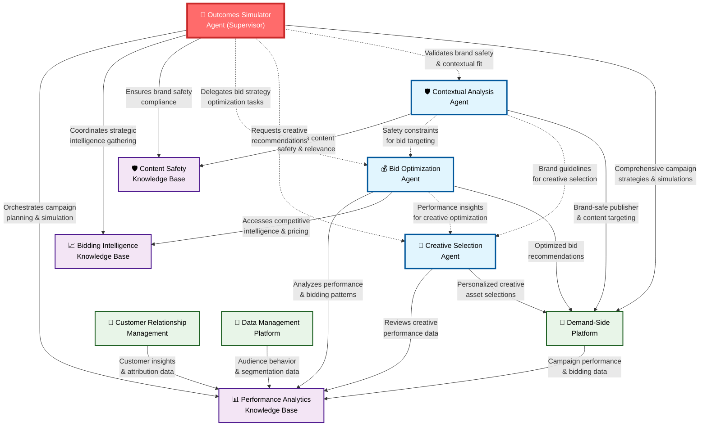
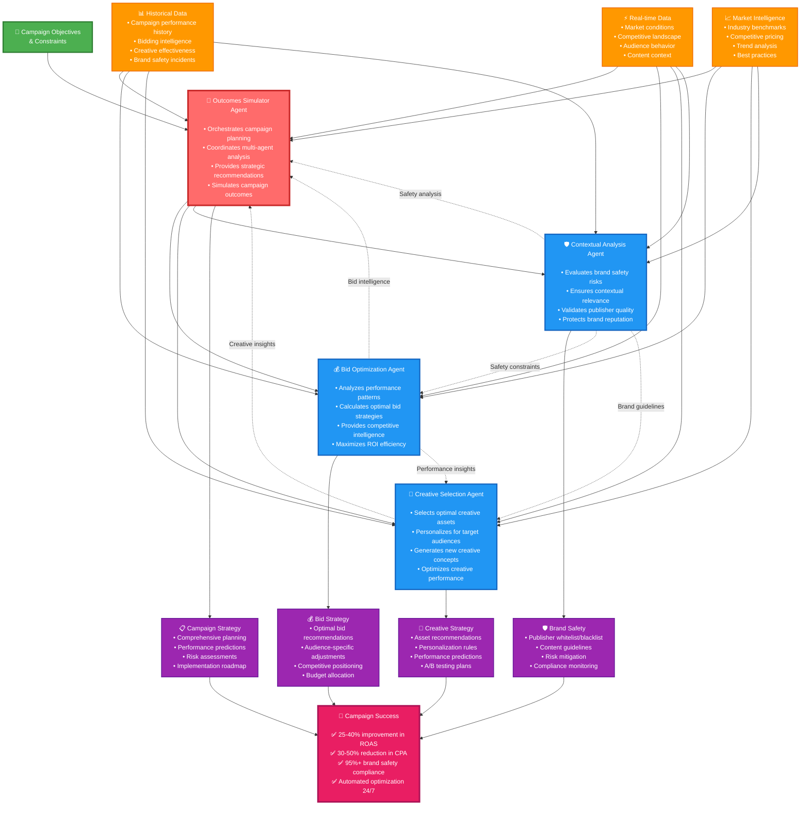

# Advertiser & Agency View: Agents for Campaign Optimization

---

## Overview

The Advertiser & Agency use case AI agents automate four critical campaign optimization functions:

- **Outcomes Simulator Agent** - Orchestrate comprehensive campaign simulations and strategic planning
- **Bid Optimization Agent** - Optimize bidding strategies for maximum ROI and performance  
- **Creative Selection Agent** - Select and personalize creative assets for target audiences
- **Contextual Analysis Agent** - Ensure brand safety and contextual relevance across placements

---

## Technical Architecture

---

## Business Value Flow

---

## Outcomes Simulator Agent (Supervisor)

### The Challenge:
- **Campaign Complexity**: Modern campaigns involve multiple variables - audience targeting, creative variations, bidding strategies, and placement selections
- **Performance Prediction**: Advertisers need to understand campaign outcomes before significant budget commitments
- **Strategic Coordination**: Campaign success requires seamless coordination between bidding, creative, and safety strategies

### What the Outcomes Simulator Agent Demonstrates:
- **Strategic Orchestration**: Acts as the master strategist coordinating with specialist agents for comprehensive campaign planning
- **Predictive Analytics**: Simulates campaign outcomes using AI-driven performance modeling and scenario analysis
- **Holistic Optimization**: Provides integrated recommendations that balance performance, safety, and efficiency goals

### Value Add Examples:
- Comprehensive campaign planning with outcome predictions, integrated strategy recommendations across all campaign elements, risk assessment and mitigation planning, data-driven budget allocation optimization

### Demo Scenarios Available:
**Recommended for Presentations:**
1. **"Premium Luxury Brand Launch"** - Showcase comprehensive campaign planning for high-value brand protection
2. **"Performance Marketing Scale-Up"** - Demonstrate ROI optimization and efficient budget scaling strategies
3. **"Competitive Market Entry"** - Show strategic positioning and competitive intelligence integration

### Example (numbers may vary):
*"For instance, when using the 'Premium Luxury Brand Launch' scenario, the agent orchestrates a comprehensive strategy predicting 3.8x ROAS with 95% brand safety compliance, coordinating bid optimization to target premium inventory at $8.50 CPM, creative selection for luxury aesthetic appeal, and contextual analysis ensuring placement only on verified premium publishers."*

---

## Bid Optimization Agent

### The Challenge:
- **Bidding Complexity**: Determining optimal bid amounts across multiple audiences, contexts, and competitive landscapes
- **Performance Efficiency**: Balancing reach and cost efficiency to maximize return on ad spend
- **Dynamic Markets**: Adapting to constantly changing market conditions and competitive pressure

### What the Bid Optimization Agent Demonstrates:
- **Data-Driven Bidding**: Analyzes historical performance and market intelligence to recommend optimal bid strategies
- **Audience Value Analysis**: Calculates audience-specific bid adjustments based on conversion potential and lifetime value
- **Competitive Intelligence**: Provides market positioning insights and competitive bid strategy recommendations

### Value Add Examples:
- Increase ROAS through optimal bid allocation, reduce cost per acquisition with efficient targeting, improve win rates while maintaining performance thresholds, automate bid adjustments based on real-time performance

### Demo Scenarios Available:
**Recommended for Presentations:**
1. **"High-Value B2B Campaign"** - Demonstrate sophisticated bid optimization for premium professional audiences
2. **"E-commerce Holiday Scaling"** - Show dynamic bid management during high-competition seasonal periods
3. **"Performance Recovery Strategy"** - Showcase bid optimization for underperforming campaigns

### Example (numbers may vary):
*"For instance, when using the 'High-Value B2B Campaign' scenario, the agent analyzes professional audience patterns and recommends $4.20 optimal bid for C-suite executives during business hours, +25% bid adjustment for LinkedIn placements, and strategic positioning 15% above market average to achieve 28% win rate with 4.2x expected ROAS."*

---

## Creative Selection Agent

### The Challenge:
- **Creative Performance**: Understanding which creative elements drive engagement and conversions across different audiences
- **Personalization Scale**: Delivering relevant creative experiences without manual creative production bottlenecks
- **Creative Fatigue**: Managing creative refresh cycles to maintain audience engagement over time

### What the Creative Selection Agent Demonstrates:
- **AI-Powered Generation**: Creates and recommends creative assets using advanced AI image generation and strategy analysis
- **Audience Personalization**: Selects and customizes creative elements based on audience preferences and behavioral patterns
- **Performance Optimization**: Continuously optimizes creative selection based on engagement metrics and conversion data

### Value Add Examples:
- Increase engagement rates through optimal creative matching, reduce creative production costs with AI generation, improve conversion rates with personalized messaging, automate creative testing and optimization

### Demo Scenarios Available:
**Recommended for Presentations:**
1. **"Dynamic Product Showcase"** - Demonstrate AI-generated creative variations for product campaigns
2. **"Lifestyle Brand Personalization"** - Show audience-specific creative customization and targeting
3. **"Multi-Format Creative Strategy"** - Showcase comprehensive creative planning across display, video, and native formats

### Example (numbers may vary):
*"For instance, when using the 'Dynamic Product Showcase' scenario, the agent generates 3 AI-powered creative variations featuring professional lifestyle settings with premium lighting, recommends blue-tone color schemes (#1E40AF, #3B82F6) for trust-building, and predicts 35% higher engagement rates compared to generic product shots."*

---

## Contextual Analysis Agent

### The Challenge:
- **Brand Safety Risks**: Protecting brand reputation from appearing alongside inappropriate or harmful content
- **Contextual Relevance**: Ensuring ads appear in environments that enhance rather than detract from brand perception
- **Scale vs. Safety**: Balancing reach objectives with brand protection requirements across thousands of publishers

### What the Contextual Analysis Agent Demonstrates:
- **Comprehensive Safety Analysis**: Evaluates publisher content and domain safety using AI-powered content classification
- **Contextual Alignment**: Analyzes content-brand fit to optimize message relevance and audience receptivity
- **Risk Management**: Provides proactive brand protection with real-time monitoring and automated blocking

### Value Add Examples:
- Protect brand reputation through proactive content filtering, improve campaign relevance with contextual alignment, increase audience trust through appropriate placement selection, automate compliance monitoring and reporting

### Demo Scenarios Available:
**Recommended for Presentations:**
1. **"Premium Brand Protection"** - Showcase comprehensive brand safety for luxury and professional brands
2. **"Family-Friendly Campaign Safety"** - Demonstrate safety protocols for family-oriented and children's products
3. **"Financial Services Compliance"** - Show specialized safety requirements for regulated industries

### Example (numbers may vary):
*"For instance, when using the 'Premium Brand Protection' scenario, the agent analyzes ESPN.com with a 95/100 safety score, categorizes it as premium sports content (IAB17), and recommends full brand-safe approval with +20% bid adjustment for sports-related campaigns while maintaining 100% compliance with luxury brand safety standards."*

--- 