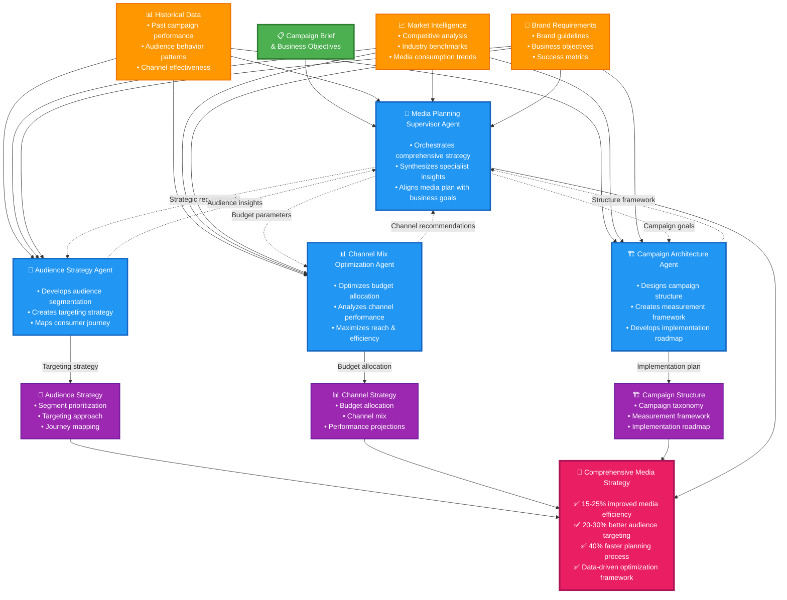

# Media Planning View: Agents for Strategic Campaign Orchestration

---

## Overview

The Media Planning use case AI agents orchestrate comprehensive campaign strategy across the entire planning lifecycle:

- **Media Planning Supervisor Agent** - Orchestrates holistic media strategy development
- **Audience Strategy Agent** - Develops precise audience targeting and segmentation
- **Channel Mix Optimization Agent** - Optimizes cross-channel budget allocation
- **Campaign Architecture Agent** - Designs campaign structure and measurement frameworks

---

## Technical Architecture

```mermaid
graph TB
    %% Media Planning AI Agents
    MPSA["🎯 Media Planning<br/>Supervisor Agent"]
    ASA["👥 Audience Strategy<br/>Agent"]
    CMOA["📊 Channel Mix<br/>Optimization Agent"]
    CAA["🏗️ Campaign Architecture<br/>Agent"]
    
    %% Knowledge Bases
    AIK["👥 Audience Insights<br/>Knowledge Base"]
    CPK["📈 Channel Performance<br/>Knowledge Base"]
    MPK["🎯 Media Planning<br/>Knowledge Base"]
    CIK["🔍 Competitive Intelligence<br/>Knowledge Base"]
    BDK["💰 Budget & Finance<br/>Knowledge Base"]
    MRK["📊 Market Research<br/>Knowledge Base"]
    BRK["🏢 Brand Guidelines<br/>Knowledge Base"]
    HCK["📜 Historical Campaign<br/>Knowledge Base"]
    
    %% Media Planning Systems
    MPS["📋 Media Planning<br/>System"]
    DMP["📁 Data Management<br/>Platform"]
    ATS["🎯 Audience Targeting<br/>System"]
    
    %% Agent to Knowledge Base Connections
    ASA -->|"Analyzes audience<br/>behavior & segments"| AIK
    ASA -->|"Reviews market<br/>research data"| MRK
    ASA -->|"Checks historical<br/>audience performance"| HCK
    ASA -->|"Evaluates competitive<br/>audience strategies"| CIK
    
    CMOA -->|"Analyzes channel<br/>performance metrics"| CPK
    CMOA -->|"Reviews budget<br/>constraints & goals"| BDK
    CMOA -->|"Checks historical<br/>channel performance"| HCK
    CMOA -->|"Evaluates competitive<br/>channel strategies"| CIK
    
    CAA -->|"Accesses media planning<br/>best practices"| MPK
    CAA -->|"Reviews brand<br/>guidelines & requirements"| BRK
    CAA -->|"Analyzes historical<br/>campaign structures"| HCK
    CAA -->|"Evaluates budget<br/>allocation frameworks"| BDK
    
    MPSA -->|"Orchestrates<br/>comprehensive strategy"| MPK
    MPSA -->|"Reviews audience<br/>insights"| AIK
    MPSA -->|"Analyzes channel<br/>performance data"| CPK
    MPSA -->|"Evaluates competitive<br/>landscape"| CIK
    MPSA -->|"Checks budget<br/>parameters"| BDK
    MPSA -->|"Reviews brand<br/>requirements"| BRK
    
    %% Cross-Agent Collaboration
    ASA -.->|"Audience segmentation<br/>& targeting strategy"| MPSA
    CMOA -.->|"Channel mix &<br/>budget allocation"| MPSA
    CAA -.->|"Campaign structure<br/>& measurement framework"| MPSA
    
    MPSA -.->|"Strategic audience<br/>requirements"| ASA
    MPSA -.->|"Budget parameters<br/>& objectives"| CMOA
    MPSA -.->|"Campaign goals<br/>& structure needs"| CAA
    
    %% System Integration
    MPS -->|"Planning templates<br/>& frameworks"| MPK
    DMP -->|"Audience data<br/>& insights"| AIK
    ATS -->|"Targeting capabilities<br/>& performance"| CPK
    
    %% Output Actions
    MPSA -->|"Comprehensive<br/>media strategy"| MPS
    ASA -->|"Audience targeting<br/>recommendations"| ATS
    CMOA -->|"Channel allocation<br/>& budget plan"| MPS
    CAA -->|"Campaign structure<br/>& measurement plan"| MPS
    
    %% Styling
    classDef agent fill:#e1f5fe,stroke:#01579b,stroke-width:3px,color:#000
    classDef kb fill:#f3e5f5,stroke:#4a148c,stroke-width:2px,color:#000
    classDef system fill:#e8f5e8,stroke:#1b5e20,stroke-width:2px,color:#000
    classDef collaboration stroke-dasharray: 5 5,stroke:#ff6f00,stroke-width:2px
    
    class MPSA,ASA,CMOA,CAA agent
    class AIK,CPK,MPK,CIK,BDK,MRK,BRK,HCK kb
    class MPS,DMP,ATS system
```

---

## Business Value Flow

---

## Media Planning Supervisor Agent

### The Challenge:
- **Strategic Complexity**: Media planning requires synthesizing multiple disciplines and data sources
- **Siloed Expertise**: Traditional planning separates audience, channel, and measurement specialists
- **Integration Gaps**: Critical insights often get lost between planning teams
- **Business Alignment**: Media plans frequently disconnect from core business objectives

### What the Media Planning Supervisor Agent Demonstrates:
- **Strategic Orchestration**: Coordinates specialized planning teams for comprehensive strategy
- **Insight Synthesis**: Combines audience, channel, and measurement expertise into unified recommendations
- **Business Alignment**: Ensures media strategy directly supports business objectives and KPIs

### Value Add Examples:
- Reduce planning time by 40%, improve media efficiency by 15-25%, ensure consistent cross-channel strategy, eliminate planning silos, create data-driven optimization frameworks

### Demo Scenarios Available:
**Recommended for Presentations:**
1. **"Integrated Multi-Channel Campaign Strategy"** - Showcase comprehensive media planning across all channels with unified messaging
2. **"Seasonal Campaign Architecture Planning"** - Demonstrate phased budget allocation and channel sequencing
3. **"Cross-Platform Attribution Media Architecture"** - Show attribution-informed media strategy for complex customer journeys

### Example (numbers may vary):
*"For instance, when using the 'Integrated Multi-Channel Campaign Strategy' scenario, the agent orchestrates a cohesive $750,000 media plan spanning social media, digital video, search, display, and influencer partnerships. It synthesizes audience insights to ensure consistent messaging while optimizing each channel's unique strengths, resulting in 22% higher engagement and 18% improved ROAS compared to siloed planning approaches."*

---

## Audience Strategy Agent

### The Challenge:
- **Audience Complexity**: Modern audiences are fragmented across devices, platforms, and behaviors
- **Data Integration**: First-party, third-party, and contextual data must be synthesized effectively
- **Privacy Evolution**: Targeting strategies must adapt to evolving privacy regulations
- **Journey Mapping**: Understanding the complete consumer journey requires multiple data sources

### What the Audience Strategy Agent Demonstrates:
- **Advanced Segmentation**: Creates sophisticated audience segments based on behavior, intent, and value
- **Privacy-First Approach**: Develops targeting strategies that balance performance with compliance
- **Journey Orchestration**: Maps complete consumer journeys across touchpoints and devices

### Value Add Examples:
- Improve targeting precision by 20-30%, reduce audience overlap waste, increase first-party data activation, create privacy-compliant targeting frameworks, optimize frequency across audience segments

### Demo Scenarios Available:
**Recommended for Presentations:**
1. **"Cross-Device Attribution Audience Strategy"** - Demonstrate audience targeting across complex device journeys
2. **"Privacy-First Audience Architecture"** - Show first-party data activation in cookieless environments
3. **"High-Value Segment Identification"** - Showcase predictive modeling for audience value scoring

### Example (numbers may vary):
*"For instance, when using the 'Cross-Device Attribution Audience Strategy' scenario, the agent analyzes complex customer journeys showing mobile discovery (40% attribution), desktop research (35%), and tablet conversion (25%). It develops a coordinated targeting strategy that values each touchpoint appropriately, resulting in 28% higher conversion rates and 22% lower cost per acquisition compared to last-click attribution models."*

---

## Channel Mix Optimization Agent

### The Challenge:
- **Channel Proliferation**: Marketers face an ever-expanding universe of media channels
- **Budget Allocation**: Determining optimal investment across channels is increasingly complex
- **Performance Measurement**: Cross-channel attribution remains challenging
- **Synergy Effects**: Channel interactions and halo effects are difficult to quantify

### What the Channel Mix Optimization Agent Demonstrates:
- **Data-Driven Allocation**: Uses performance data to optimize budget distribution across channels
- **Synergy Modeling**: Identifies and leverages cross-channel amplification effects
- **Scenario Planning**: Models different budget scenarios and performance outcomes

### Value Add Examples:
- Improve media efficiency by 15-25%, optimize reach and frequency across channels, identify high-performing channel combinations, create flexible allocation frameworks for rapid optimization

### Demo Scenarios Available:
**Recommended for Presentations:**
1. **"Connected TV vs Traditional Display ROI"** - Compare performance across traditional and emerging channels
2. **"Cross-Channel Synergy Optimization"** - Demonstrate how channels work together for amplified results
3. **"Budget Scenario Modeling"** - Show performance projections across different investment levels

### Example (numbers may vary):
*"For instance, when using the 'Connected TV vs Traditional Display ROI' scenario, the agent analyzes the impact of reallocating 40% of a $65,000 budget from traditional display to Connected TV. It models audience overlap (45% with display, 62% with mobile video) and projects a 28% increase in incremental reach with only a 12% increase in overall CPM, resulting in 18% higher brand recall and 22% stronger consideration metrics."*

---

## Campaign Architecture Agent

### The Challenge:
- **Structural Complexity**: Campaign organization becomes increasingly complex in omnichannel environments
- **Measurement Framework**: Defining consistent KPIs and attribution models is challenging
- **Implementation Planning**: Coordinating campaign launch across channels requires precise planning
- **Optimization Framework**: Creating systematic optimization protocols is often overlooked

### What the Campaign Architecture Agent Demonstrates:
- **Structural Design**: Creates logical campaign hierarchies and taxonomies
- **Measurement Planning**: Develops comprehensive measurement frameworks aligned with business goals
- **Implementation Roadmap**: Provides detailed launch plans and optimization schedules

### Value Add Examples:
- Streamline campaign setup by 40%, ensure consistent measurement across channels, create clear optimization protocols, develop scalable campaign structures, align tactical execution with strategic goals

### Demo Scenarios Available:
**Recommended for Presentations:**
1. **"Global Campaign Structure Standardization"** - Demonstrate consistent campaign architecture across markets
2. **"Attribution-Ready Campaign Design"** - Show measurement-optimized campaign structure
3. **"Phased Implementation Roadmap"** - Showcase detailed campaign rollout planning

### Example (numbers may vary):
*"For instance, when using the 'Phased Implementation Roadmap' scenario, the agent designs a comprehensive campaign structure for a 12-week holiday season campaign with distinct phases: Awareness (weeks 1-4, 30% budget), Consideration (weeks 5-8, 45% budget), and Conversion (weeks 9-12, 25% budget). It provides detailed naming conventions, tracking parameters, and optimization triggers for each phase, resulting in 35% faster setup time and 28% more efficient budget utilization."*