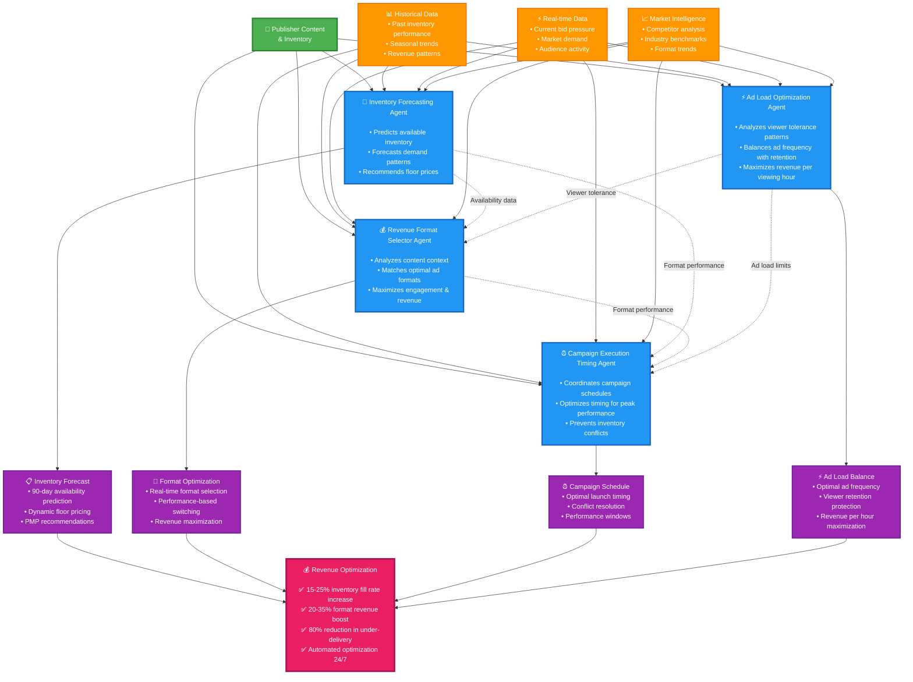

# Publisher View: Agents for Revenue Optimization

---

## Overview

The Publisher use case AI agents automate four critical revenue optimization functions:

- **Inventory Forecasting Agent** - Predict inventory availability with 95%+ accuracy
- **Revenue Format Selector Agent** - Optimize ad formats for 20-35% revenue increase  
- **Campaign Execution Timing Agent** - Perfect campaign timing for maximum performance
- **Ad Load Optimization Agent** - Balance ad revenue with viewer retention

---

## Technical Architecture

```mermaid
graph TB
    %% Publisher AI Agents
    IFA["🔮 Inventory Forecasting<br/>Agent"]
    RFSA["💰 Revenue Format<br/>Selector Agent"]
    CETA["⏰ Campaign Execution<br/>Timing Agent"]
    ALOA["⚡ Ad Load Optimization<br/>Agent"]
    
    %% Knowledge Bases
    HID["📊 Historical Inventory<br/>Database"]
    MPD["📈 Market Performance<br/>& Trends KB"]
    AFD["🎯 Ad Format<br/>Performance KB"]
    ABD["👥 Audience Behavior<br/>& Segmentation KB"]
    ROK["⚡ Revenue Optimization<br/>Rules KB"]
    CPD["📋 Campaign Performance<br/>& Analytics KB"]
    CIK["🕵️ Competitive Intelligence<br/>& Market Data KB"]
    RTD["⚡ Real-time Bidding<br/>& Pricing KB"]
    
    %% Publisher Systems
    PS["🏢 Publisher<br/>Ad Server"]
    DMP["📁 Data Management<br/>Platform"]
    SSP["🔗 Supply-Side<br/>Platform"]
    
    %% Agent to Knowledge Base Connections
    IFA -->|"Reads historical patterns<br/>& seasonal trends"| HID
    IFA -->|"Analyzes market demand<br/>& competitor activity"| CIK
    IFA -->|"Accesses real-time<br/>bid pressure data"| RTD
    IFA -->|"Reviews audience<br/>consumption patterns"| ABD
    
    RFSA -->|"Evaluates format<br/>performance metrics"| AFD
    RFSA -->|"Analyzes audience<br/>engagement by format"| ABD
    RFSA -->|"Applies revenue<br/>optimization rules"| ROK
    RFSA -->|"Reviews market<br/>format trends"| MPD
    
    CETA -->|"Accesses campaign<br/>performance history"| CPD
    CETA -->|"Monitors market<br/>timing patterns"| MPD
    CETA -->|"Checks competitive<br/>campaign schedules"| CIK
    CETA -->|"Applies optimization<br/>timing rules"| ROK
    
    ALOA -->|"Analyzes viewer<br/>retention data"| ABD
    ALOA -->|"Reviews monetization<br/>performance"| MPD
    ALOA -->|"Checks ad load<br/>tolerance patterns"| HID
    ALOA -->|"Applies viewer<br/>experience rules"| ROK
    
    %% Cross-Agent Collaboration
    IFA -.->|"Inventory availability<br/>forecasts"| RFSA
    IFA -.->|"Optimal timing<br/>recommendations"| CETA
    RFSA -.->|"Format performance<br/>insights"| CETA
    ALOA -.->|"Viewer tolerance<br/>thresholds"| RFSA
    ALOA -.->|"Ad load scheduling<br/>constraints"| CETA
    
    %% System Integration
    PS -->|"Inventory levels<br/>& performance data"| HID
    DMP -->|"Audience insights<br/>& behavior data"| ABD
    SSP -->|"Real-time bidding<br/>& pricing data"| RTD
    
    %% Output Actions
    IFA -->|"Inventory forecasts<br/>& floor price recommendations"| PS
    RFSA -->|"Dynamic format<br/>selection rules"| PS
    CETA -->|"Optimal campaign<br/>scheduling"| PS
    ALOA -->|"Ad load frequency<br/>& placement optimization"| PS
    
    %% Styling
    classDef agent fill:#e1f5fe,stroke:#01579b,stroke-width:3px,color:#000
    classDef kb fill:#f3e5f5,stroke:#4a148c,stroke-width:2px,color:#000
    classDef system fill:#e8f5e8,stroke:#1b5e20,stroke-width:2px,color:#000
    classDef collaboration stroke-dasharray: 5 5,stroke:#ff6f00,stroke-width:2px
    
    class IFA,RFSA,CETA,ALOA agent
    class HID,MPD,AFD,ABD,ROK,CPD,CIK,RTD kb
    class PS,DMP,SSP system
```

---

## Business Value Flow

---

## Inventory Forecasting Agent

### The Challenge:
- **Supply/Demand Balance**: Publishers are constantly trying to balance supply and demand
- **Prediction Accuracy**: They need to predict available inventory across different placements, timeframes, and audience segments
- **Revenue Risk**: Manual forecasting often leads to over-promising to advertisers or leaving money on the table

### What the Inventory Forecasting Agent Demonstrates:
- **Intelligent Analysis**: Continuously analyzes historical performance data, seasonal trends, and real-time market signals
- **Accurate Predictions**: Predicts available inventory up to 90 days out
- **Optimization Insights**: Identifies optimization opportunities you might miss

### Value Add Examples:
- Reduce under-delivery risk, increase fill rates, optimize floor prices dynamically, adjust private marketplace deals based on forecasted demand

### Demo Scenarios Available:
**Recommended for Presentations:**
1. **"Netflix Original Fitness Content Partnership"** - Showcase inventory forecasting for premium streaming content partnerships
2. **"Post-Pandemic Fitness Boom Inventory"** - Demonstrate seasonal trend analysis and demand prediction
3. **"Competitive Launch Window Defense"** - Show competitive intelligence and protective inventory strategies

### Example (numbers may vary):
*"For instance, when using the 'Post-Pandemic Fitness Boom Inventory' scenario, the agent predicts 1.8x growth in health/wellness streaming content consumption and recommends reserving inventory 2-3 months in advance during peak fitness season (August-November) while adjusting floor prices 15-20% higher during anticipated demand spikes."*

---

## Revenue Format Selector Agent

### The Challenge:
- **Format Complexity**: Publishers face multiple ad format options - display, video, native, rich media - each with different performance characteristics
- **Performance Variance**: Each format performs differently based on content context, audience demographics, and placement location
- **Testing Limitations**: Manual A/B testing is slow and cannot cover all possible format-content combinations effectively

### What the Revenue Format Selector Agent Demonstrates:
- **Real-time Analysis**: Analyzes content in real-time and matches it with highest-performing ad formats based on current conditions
- **Multi-factor Optimization**: Considers audience behavior, content type, device usage, and current market demand simultaneously
- **Portfolio Management**: Automatically optimizes format selection across entire inventory portfolio for maximum yield

### Value Add Examples:
- Increase revenue through optimal format matching, improve viewability rates, enhance user experience with more relevant ad formats, balance immediate revenue with long-term audience retention

### Demo Scenarios Available:
**Recommended for Presentations:**
1. **"Smart Connectivity Technology Showcase"** - Demonstrate format optimization for technology-focused content partnerships
2. **"Six Colorway Campaign Personalization"** - Show dynamic creative optimization and personalized format selection strategies
3. **"Innovative Ad Format Testing"** - Showcase next-generation interactive ad formats and advanced technology integration

### Example (numbers may vary):
*"For instance, when using the 'Smart Connectivity Technology Showcase' scenario, the agent analyzes CloudFlow X1's smart tracking technology and recommends interactive video formats during Netflix tech documentaries, QR-enabled overlays during Amazon Prime innovation content, and second-screen experiences during Apple TV+ future-tech programming - optimizing both engagement and revenue for each platform's unique capabilities."*

---

## Campaign Execution Timing Agent

### The Challenge:
- **Timing Impact**: Even with optimal inventory and formats, poor timing can significantly reduce campaign performance
- **Coordination Complexity**: Publishers must coordinate with advertiser objectives, seasonal trends, and competitive activity simultaneously
- **Resource Conflicts**: Manual campaign scheduling often conflicts with optimal inventory availability and audience engagement patterns

### What the Campaign Execution Timing Agent Demonstrates:
- **Portfolio Orchestration**: Coordinates campaign timing across entire publisher portfolio to maximize performance
- **Multi-factor Analysis**: Analyzes advertiser goals, inventory patterns, market dynamics, and audience behavior patterns
- **Performance Optimization**: Recommends optimal launch windows, pacing strategies, and scheduling coordination

### Value Add Examples:
- Improve campaign performance metrics, prevent inventory conflicts through automatic coordination, increase fill rates and CPMs through optimal timing, enhance advertiser satisfaction leading to renewals and referrals

### Demo Scenarios Available:
**Recommended for Presentations:**
1. **"Urban Professional Streaming Patterns"** - Demonstrate audience behavior analysis and optimal timing coordination with distinct streaming patterns analysis
2. **"Seasonal Campaign Coordination"** - Show how timing optimization handles seasonal trends and competitive campaign schedules
3. **"Multi-Platform Launch Strategy"** - Demonstrate coordinated timing across multiple content platforms and audience segments

### Example (numbers may vary):
*"For instance, when using the 'Urban Professional Streaming Patterns' scenario, the agent analyzes that the target audience watches 65% of fitness content on weekends and recommends launching the CloudFlow X1 campaign on Friday at 12:01 AM to capture weekend binge viewing, while scheduling 60% of budget during weekend dayparts and shifting weekday focus to 8-10 PM documentary viewing when this audience is most engaged with sustainability content."*

---

## Ad Load Optimization Agent

### The Challenge:
- **Revenue vs. Retention**: Publishers need ad revenue but excessive ad frequency drives viewers away
- **Viewer Tolerance**: Different audiences have varying ad tolerance levels based on demographics and content preferences
- **Content Sensitivity**: Some content types can support higher ad loads than others without impacting engagement
- **Platform Competition**: Streaming platforms with lower ad frequency are attracting viewers from traditional publishers

### What the Ad Load Optimization Agent Demonstrates:
- **Viewer Behavior Analysis**: Analyzes real-time viewer drop-off patterns and engagement metrics to understand tolerance thresholds
- **Dynamic Ad Frequency**: Automatically adjusts ad load based on content type, viewer segment, and session context
- **Revenue Per Hour Optimization**: Maximizes revenue per viewing hour while protecting viewer experience and retention

### Value Add Examples:
- Increase revenue per viewer hour through optimal ad placement, reduce viewer churn through intelligent ad load management, increase content completion rates, automate optimization between immediate revenue and long-term viewer value

### Demo Scenarios Available:
**Recommended for Presentations:**
1. **"Premium Streaming Ad Load Balance"** - Optimize ad frequency for premium content without driving subscribers away
2. **"Binge-Watching Ad Tolerance"** - Dynamic ad load adjustment for marathon viewing sessions with declining completion rates
3. **"Content-Specific Ad Optimization"** - Genre-based ad placement optimization accounting for different tolerance levels across content types

### Example (numbers may vary):
*"For instance, when using the 'Binge-Watching Ad Tolerance' scenario, the agent analyzes viewer fatigue patterns and recommends reducing ad load from 3.2 to 2.1 ads per episode after the second consecutive episode, while increasing ad value through premium targeting - maintaining 85%+ completion rates and achieving 20% higher revenue per marathon session."* 