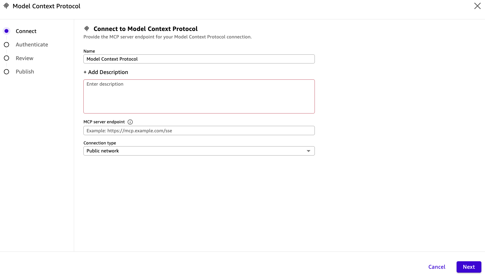
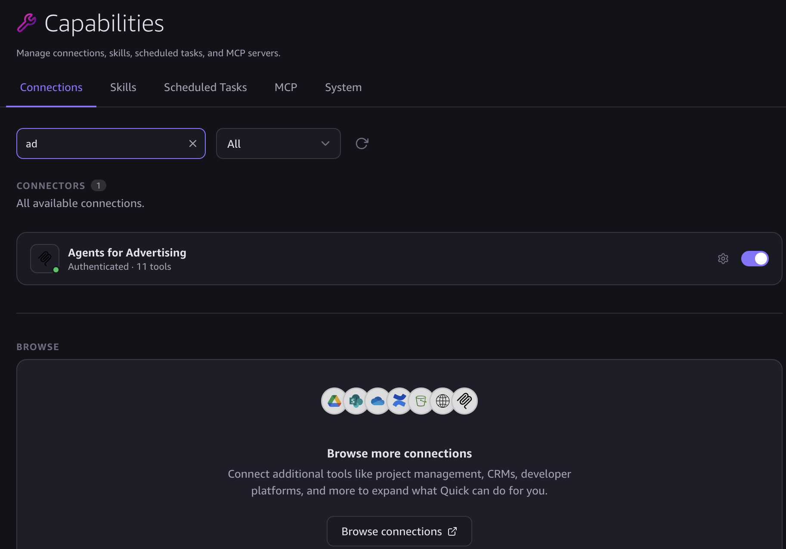
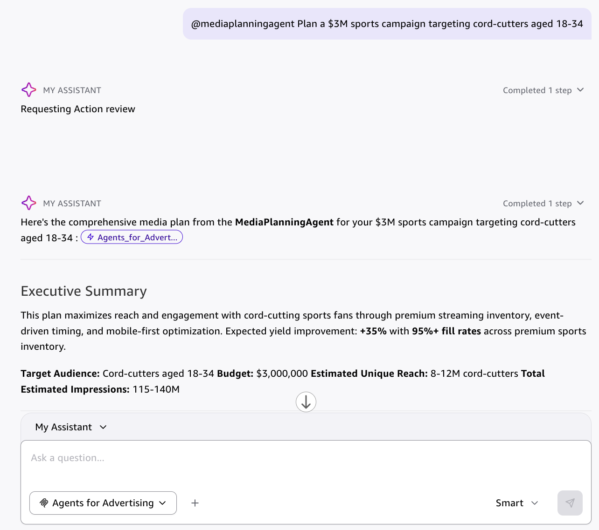

# Interacting with A4A Agents

## Contents

- [Method 1: Angular UI](#method-1-angular-ui-standalone-web-app)
- [Method 2: Quick Suite (OAuth)](#method-2-quick-suite-oauth--recommended-for-business-users)
- [Method 3: Kiro / Claude Desktop / Cursor (IAM)](#method-3-kiro--claude-desktop--cursor-iam--recommended-for-developers)
- [Method 4: Direct SDK](#method-4-direct-sdk-programmatic)
- [First Test & Example Prompts](#first-test-all-methods)
- [Customer-Specific Demo Data (Quick Skill)](#customer-specific-demo-data-quick-skill)
- [Troubleshooting](#troubleshooting)
- [For IT Admins — Deployment](#for-it-admins--deployment)
  - [Path A: Cognito OAuth](#path-a-cognito-oauth-default--self-contained)
  - [Path B: External OAuth](#path-b-external-oauth-bring-your-own-idp)
  - [Updating Tool Schemas](#updating-tool-schemas-after-code-changes)
- [Async Polling Pattern](#async-polling-pattern-orchestrator-agents)

---

Once agents are deployed on Amazon Bedrock AgentCore, you can interact with them in multiple ways:

| # | Method | Best For | Auth | Setup Time |
|---|--------|----------|------|-----------|
| 1 | **Angular UI** (standalone web app) | Demos, admin config, full-featured multi-agent chat | Cognito (browser login) | 0 min — just open the CloudFront URL |
| 2 | **Quick Suite** (web + desktop) | Business users who live in Quick daily | OAuth (Cognito login via Quick) | 2 min |
| 3 | **Kiro / Claude Desktop / Cursor** | Developers and SAs with AWS CLI | IAM (SigV4 via `mcp-proxy-for-aws`) | 5 min |
| 4 | **Direct SDK** | Programmatic access, CI/CD, automation | IAM (boto3/AWS SDK) | Varies |

**Recommended:**
- **Business users** → Quick Suite (OAuth) — no AWS CLI, no terminal, just sign in
- **Developers** → Kiro or Claude Desktop (IAM) — uses existing AWS credentials
- **Demos & admin** → Angular UI — full admin panel, visualizations, voice interface

---

## Method 1: Angular UI (Standalone Web App)

The deployed Angular UI provides the richest experience with multi-agent chat, visualizations, Nova Sonic voice, and a full admin panel for agent configuration.

**Setup:** None — open the CloudFront URL from deployment and log in with your Cognito credentials.

See the [Running the Guidance](../README.md#running-the-guidance) section in the README.

---

## Method 2: Quick Suite (OAuth) — Recommended for Business Users

Connect Quick Suite (web and desktop) to the A4A agents via the OAuth MCP Gateway. No AWS CLI or developer tools needed.

### Prerequisites

From the deployment script output (Phase 12), you'll need:
- **Gateway URL** (e.g., `https://a4a-oauth-gw-xxxxx.gateway.bedrock-agentcore.us-west-2.amazonaws.com/mcp`)
- **Client ID**
- **Client Secret**
- **Token URL** (e.g., `https://a4a-xxxxx.auth.us-west-2.amazoncognito.com/oauth2/token`)
- **Authorization URL** (e.g., `https://a4a-xxxxx.auth.us-west-2.amazoncognito.com/oauth2/authorize`)

### Setup Steps

1. Open **Quick Suite web** → left nav → **More** → **Connectors** → **Create for your team** → **Model Context Protocol** → **Create new**
2. Fill in (see screenshot below):



| Field | Value |
|-------|-------|
| **Name** | `Agents for Advertising` |
| **Description** | `AI advertising agents for media planning, campaign optimization, deal negotiation, and inventory management` |
| **MCP server endpoint** | Copy from deployment script output |
| **Connection purpose** | On-demand actions |
| **Authentication** | User authentication → Custom user based OAuth |
| **Client ID** | Copy from deployment script output |
| **Client Secret** | Copy from deployment script output |
| **Token URL** | Copy from deployment script output |
| **Authorization URL** | Copy from deployment script output |

3. Click **Save** — a Cognito login page will appear
4. Sign in with your **A4A credentials** (same email/password as the Angular UI)
5. Status should show **"Ready"** with tools listed

> **Note:** In a real implementation, an IT admin performs this setup once and grants team members access to the connector. Individual users don't need to configure anything — they just see the MCP tools available in their Quick chat.

**Note:** This connection syncs to Quick Desktop automatically — configure once in web, use everywhere. In Quick Desktop, enable the capability under Settings → Capabilities:



### Upload the Skill (Optional)

Once created, select the MCP connector in the chat and start your conversation:



For the best experience with agent routing and formatting, upload one or more skills:

1. Go to **Settings** → **Capabilities** → **Skills** → **Upload**
2. Upload the skill(s) from the [`quick-skill/`](../quick-skill/) directory

#### Available Skills

| Skill File | Purpose | Best For |
|------------|---------|----------|
| [`SKILL.md`](../quick-skill/SKILL.md) | Full A4A platform — all agents, scenario picker, data tools | General exploration, full demo |
| [`SKILL-media-planning.md`](../quick-skill/SKILL-media-planning.md) | Media planning assistant — RFP responses, campaign strategy | Publisher Ops demos, media plan walkthroughs |
| [`SKILL-agentic-marketplace.md`](../quick-skill/SKILL-agentic-marketplace.md) | AAMP buyer workflow — plan, negotiate, book deals | AAMP marketplace demos, deal negotiation |

#### Skill Descriptions

**SKILL.md (Main Skill)**
- Full scenario picker across all 4 tabs (Publisher Ops, Agency & Advertiser, AAMP, Playground)
- Reads scenarios dynamically from `tab-configurations.json`
- Handles both specialist (30-60s) and orchestrator (2-3 min) agent responses
- Three-message pattern: Ack → Delegation Visual → Final Result

**SKILL-media-planning.md (Media Planning)**
- Focused experience for building media plans
- Starter picker: Sample RFP (Acme Energy) or Custom brief
- Invokes `MediaPlanningAgent` which coordinates 4 specialists in parallel
- Formats the final plan as a structured proposal (audience, channels, pacing, inventory, KPIs)
- Follow-up actions: negotiate pricing, brand safety, adjust allocation, book deals

**SKILL-agentic-marketplace.md (Agentic Marketplace)**
- Natural buyer workflow for the AAMP deal lifecycle
- 3-step guided flow: Plan+Discover → Negotiate (rejection) → Counter at Floor (booked)
- Uses session continuity — seller remembers previous offers
- Decision cards guide the user through each negotiation step
- Demonstrates autonomous agent-to-agent deal negotiation with floor price enforcement

#### Tips for Demo Presentations

- **For a quick AAMP demo** → Use `SKILL-agentic-marketplace.md` — it auto-presents the starter picker and guides through the 3-step negotiation in ~3 minutes
- **For a media planning demo** → Use `SKILL-media-planning.md` — shows multi-agent collaboration and produces a polished RFP response
- **For exploration** → Use `SKILL.md` — full scenario picker with all 4 tabs
- **Session continuity** → After Step 1, subsequent steps reuse the same session so the agents remember context

---

## Method 3: Kiro / Claude Desktop / Cursor (IAM) — Recommended for Developers

Connect developer AI tools to the A4A agents via the IAM MCP Gateway using `mcp-proxy-for-aws`.

### Prerequisites

- AWS CLI configured with a profile that has gateway access
- `uv` installed (`brew install uv` or `pip install uv`)

### Setup Steps

Add to `~/.kiro/settings/mcp.json` (or equivalent for your tool):

```json
{
  "mcpServers": {
    "a4a-agents": {
      "command": "uvx",
      "timeout": 300000,
      "args": [
        "mcp-proxy-for-aws@latest",
        "<IAM_GATEWAY_URL>",
        "--metadata", "AWS_REGION=us-west-2",
        "--read-timeout", "300"
      ],
      "env": {
        "AWS_PROFILE": "<YOUR_PROFILE>"
      }
    }
  }
}
```

To deploy the IAM target (if not already done):
```bash
python agentcore/deployment/deploy_a4a_mcp_handler.py \
  --stack-prefix a4a --unique-id <ID> --region us-west-2 --profile <PROFILE> \
  --iam-target
```

---

## Method 4: Direct SDK (Programmatic)

For automation, CI/CD, or custom integrations, invoke agents directly via boto3:

```python
import boto3, json

client = boto3.client("bedrock-agentcore", region_name="us-west-2")
response = client.invoke_agent_runtime(
    agentRuntimeArn="<RUNTIME_ARN>",
    runtimeSessionId="my-session-id-at-least-33-chars-long",
    qualifier="DEFAULT",
    payload=json.dumps({
        "prompt": "@[AgencyAgent] Plan a $3M sports campaign",
        "session_id": "my-session",
        "memory_id": "default",
        "agent_name": "AgencyAgent",
    }).encode("utf-8"),
)
```

---

## First Test (All Methods)

After connecting, try:

```
List available advertising agents
```

Expected: A list of 30+ agents organized by family (Orchestrators, Demand Side, Supply Side, Intelligence & Signals, AAMP Marketplace, Agentic Ecosystem).

## Try It — Example Prompts

For a full list of scenario prompts by agent, see the [`tab-configurations.json`](../synthetic_data/configs/tab-configurations.json) file.

**Tip:** After any response, Quick will show **decision cards** — clickable follow-up actions. You can click these or type your own follow-up.

| Category | Example Prompt | Response Time |
|----------|---------------|---------------|
| Discovery | "List available agents" | Instant |
| Data lookup | "What CTV inventory is available?" | <5 seconds |
| Specialist | "Analyze audience for cord-cutters 18-34" | 30-90 seconds |
| Orchestrator | "Plan a $3M Q4 sports campaign" | 2-5 minutes |
| Negotiation | "Negotiate 15% discount on ESPN CTV package" | 2-5 minutes |

---

## Customer-Specific Demo Data (Quick Skill)

The **A4A Customer Demo** skill automates end-to-end data preparation for customer-specific demos. It researches the customer's content portfolio, generates grounded synthetic data, deploys it, and tests agent responses.

**Trigger phrases** (in Quick):
- `"a4a demo for Nine-Seven JV, AU market"`
- `"generate a4a demo data"`
- `"prepare a4a demo for Fox Sports"`

**What it does:**
1. Researches customer content rights (web search + vault)
2. Generates `config.yaml` with content properties, audiences, advertisers, and demo scenarios
3. Produces CSV overlay files + KB JSON docs — written directly to deploy locations
4. Pauses for review before deploying
5. Deploys (KB upload + Lambda + seller redeploy)
6. Tests with an agent invocation to verify data grounding

**Skill file:** [`quick-skill/SKILL-customer-demo.md`](../quick-skill/SKILL-customer-demo.md)

**Full manual guide:** [`docs/CUSTOMER_DATA_GUIDE.md`](CUSTOMER_DATA_GUIDE.md)

---

## Troubleshooting

| Issue | Solution |
|-------|----------|
| "Creation failed" in Quick Suite | Check Client ID/Secret. Delete failed connection and recreate. |
| Cognito login page doesn't appear | Verify Authorization URL. Ensure App Client has `code` flow enabled. |
| "invalid_client_secret" | Re-check secret from IT admin (deploy script console output). |
| Empty response | Agent timed out. Try again — runtime may have been cold-starting. |
| Timeout after 2+ minutes | Normal for orchestrators. Wait up to 5 minutes. |
| "Unknown tool" after restart | Reconnect the MCP server in settings. |

## For IT Admins — Deployment

### Path A: Cognito OAuth (default — self-contained)

Creates a Cognito User Pool, resource server, app client, and OAuth gateway automatically:

```bash
python agentcore/deployment/deploy_a4a_mcp_handler.py \
  --stack-prefix a4a --unique-id <ID> --region us-west-2 --profile <PROFILE>
```

The script outputs all credentials needed for business users: Gateway URL, Client ID, Client Secret, Token URL, Authorization URL.

### Path B: External OAuth (bring your own IDP)

Use this when your organization has an existing OIDC identity provider (Okta, Auth0, Ping, etc.) instead of Cognito. No Cognito resources are created.

```bash
python agentcore/deployment/deploy_a4a_mcp_handler.py \
  --stack-prefix a4a --unique-id <ID> --region us-west-2 --profile <PROFILE> \
  --mode oauth-external \
  --well-known-url "https://your-idp.example.com/.well-known/openid-configuration" \
  --allowed-clients "your-client-id" \
  --gateway-name "a4a-oauth-gw-<ID>-<provider>"
```

**Quick Suite connection config for external OAuth:**

| Field | Value |
|-------|-------|
| **Authentication** | Custom user based OAuth |
| **Client ID** | Your IDP's client ID |
| **Client Secret** | From your IDP (not managed by this script) |
| **Token URL** | From your IDP's well-known config |
| **Authorization URL** | From your IDP's well-known config |
| **Scope** | Leave empty — not required |

Key differences from Cognito path:
- No `allowedAudience` or `allowedScopes` enforced by gateway
- No Cognito resources created — client credentials managed by your IDP
- Same 12 tools available through the same Lambda backends

### IAM Target (for developers)

```bash
python agentcore/deployment/deploy_a4a_mcp_handler.py \
  --stack-prefix a4a --unique-id <ID> --region us-west-2 --profile <PROFILE> \
  --iam-target
```

### Updating Tool Schemas (After Code Changes)

When Lambda code changes, update all gateway tool schemas:

```bash
# Update all gateways (discovers from config files)
python agentcore/deployment/deploy_a4a_mcp_handler.py \
  --stack-prefix a4a --unique-id <ID> --region us-west-2 --profile <PROFILE> \
  --mode update-targets

# Or a specific gateway by full ID
python agentcore/deployment/deploy_a4a_mcp_handler.py \
  --stack-prefix a4a --unique-id <ID> --region us-west-2 --profile <PROFILE> \
  --mode update-targets --gateway-id <full-gateway-id>
```

**Note:** `--gateway-id` requires the full identifier (with random suffix), not just the name. After updating schemas, reconnect Quick (delete + re-create the MCP connection) to pick up new tools.

See [`quick-skill/mcp-config-sample.json`](../quick-skill/mcp-config-sample.json) for the full configuration reference.

---

## Async Polling Pattern (Orchestrator Agents)

Orchestrator agents (AgencyAgent, MediaPlanningAgent, etc.) may take 60-180s. The MCP handler uses a proactive timeout pattern:

```
1. invoke_agent(agent_name, prompt, async=true)
   → If agent responds within 60s: {status: "completed", response}
   → If timeout: {status: "processing", session_id}

2. get_agent_conversation(session_id, agent_name)
   → Long-polls for up to 55s checking AgentCore Memory
   → Returns: "completed" (with full response), "in_progress", or "not_found"
```

The agent always completes — it runs independently of the client connection. Results are stored in AgentCore Memory and retrieved via polling.

Quick's SKILL.md instructs it to handle this automatically — no user action needed.
