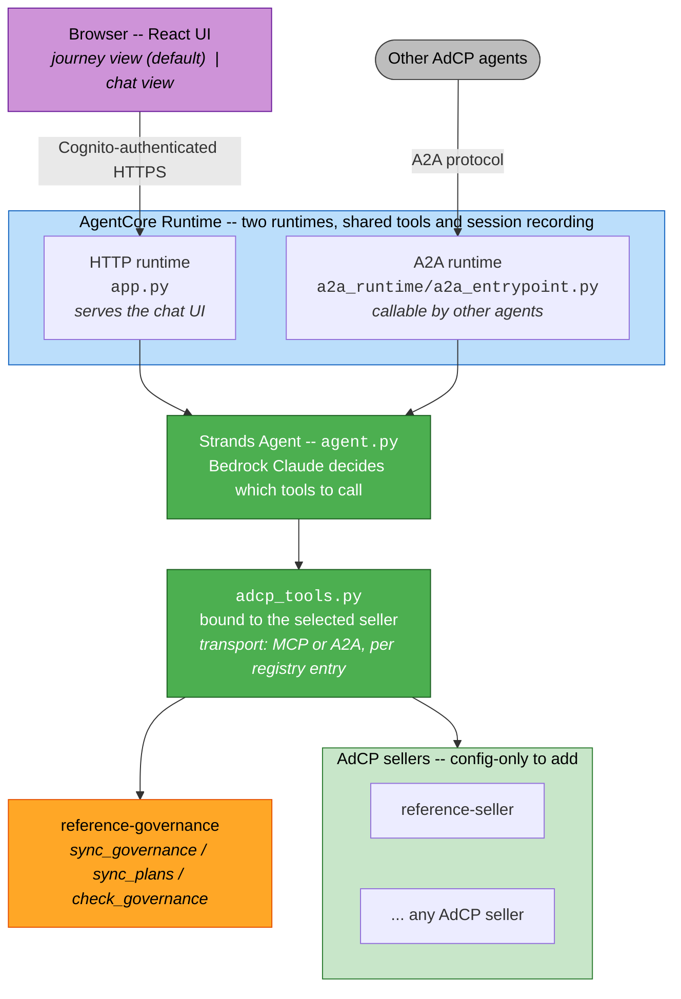
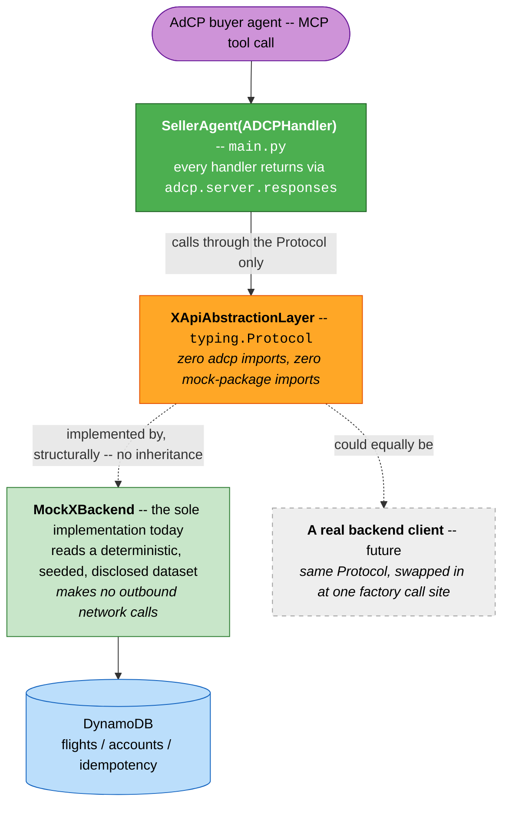
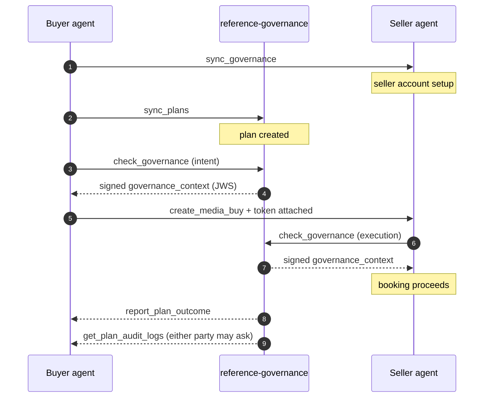

# AdCP Reference Agents on AWS

A collection of [AdCP](https://docs.adcontextprotocol.org/) (Ad Context Protocol) reference
agents — buyer, sellers, a campaign-governance agent, and supporting services — all built on the
official [`adcp`](https://pypi.org/project/adcp/) Python SDK and deployed to
[AWS Bedrock AgentCore Runtime](https://aws.amazon.com/bedrock/agentcore/). The goal is a
self-contained, end-to-end AdCP environment: a real reasoning buyer agent that can discover
inventory, check campaign governance, and book media against a set of AdCP-conformant sellers
covering different inventory shapes (audio, news publisher, retail media in progress) — with no
third-party production credentials required anywhere in the stack.

Every seller's inventory is synthetic, seeded, and disclosed (`sandbox: true` on every response).
No real advertiser, publisher, or exchange data is used or represented anywhere in this repo.

## Agents at a glance

| Agent | Role | AdCP protocols | Transport |
|---|---|---|---|
| [`agents/buyer/reference-buyer`](agents/buyer/reference-buyer/) | Buyer | Media Buy (client) | HTTP + A2A (two runtimes) |
| [`agents/seller/reference-seller`](agents/seller/reference-seller/) | Seller — minimal fixed sandbox | Media Buy, Accounts | MCP |
| [`agents/governance/reference-governance`](agents/governance/reference-governance/) | Campaign governance agent | Campaign Governance | MCP |
| *(designed, not built)* retail media seller — [see below](#retail-media-seller--designed-not-yet-built) | Seller — retail media ad inventory (CPC/CPA floor pricing, catalog match) | Media Buy, Accounts | MCP |

## The buyer agent

**[`agents/buyer/reference-buyer`](agents/buyer/reference-buyer/)** — an LLM-driven [Strands
Agents](https://strandsagents.com/) buyer, backed by Claude via Amazon Bedrock, deployed to AWS
Bedrock AgentCore Runtime. It decides which AdCP tools to call and when, based on what the user
asks for, against whichever seller is selected from a configurable registry
(`SELLER_AGENTS_JSON`) — any AdCP seller can be added as a config entry, not a code change.

Deployed twice, sharing the same tools/registry/session-recording:
- **HTTP** (`app.py`) — serves this project's own chat UI (a React app with a scroll-driven
  "journey view" as its default route, plus a classic chat view).
- **A2A** (`a2a_runtime/`) — lets other agents invoke this buyer directly over the
  [A2A protocol](https://a2a-protocol.org/).

**AdCP tasks called**: `get_products`, `get_adcp_capabilities`, `list_creative_formats` (read-only
discovery), plus `sync_accounts`/`sync_governance`/`sync_plans`/`check_governance` and
`create_media_buy`/`update_media_buy`/`get_media_buys`/`get_media_buy_delivery` for the full
governed spend-commit lifecycle. See its own
[README](agents/buyer/reference-buyer/README.md) for the complete tool table, the campaign
governance flow, and the seller-agent registry format.

### Reference architecture — buyer agent



## The seller agents

All agents share the same AdCP-conformance shape: built on `ADCPHandler` +
`adcp.server.serve`, responses built exclusively through `adcp.server.responses` builders,
DynamoDB-backed state (`adcp.server.idempotency`), deployed as an MCP server on AgentCore Runtime
behind the same shared Cognito JWT authorizer the buyer agent uses. Each keeps its actual backend
data behind a `typing.Protocol` abstraction layer with exactly one mock implementation today, so a
real backend integration later is a drop-in swap at one factory call site, not a rewrite.

### `reference-seller` — minimal fixed sandbox

**[`agents/seller/reference-seller`](agents/seller/reference-seller/)** — the simplest conformant
seller: a small, fixed, hand-authored product catalog (no generated dataset, no mock backend
layer). Exists so the buyer agent always has something to talk to with zero setup.

**AdCP tasks**: 11 advertised — `get_adcp_capabilities`, `get_products`, `list_creative_formats`,
`create_media_buy`, `update_media_buy`, `get_media_buys`, `get_media_buy_delivery`,
`provide_performance_feedback`, `sync_accounts`, `list_accounts`, `sync_governance`. That is all 7
required Media Buy Protocol tasks plus the Accounts Protocol. `sync_creatives` is correctly N/A (no
creative library declared).

It also enforces the seller side of Campaign Governance against `reference-governance`: it verifies
the buyer's intent-phase `governance_context` JWS — signature via the buyer's `brand.json` → the
governance agent's published JWKS, plus `aud`/`sub`/`phase`/`exp`, revocation and `jti` replay — and
then runs its own outbound `check_governance` execution check, failing closed on denial or
unreachability. Details and the current open items are in
[`SELLER-AGENT-ADCP-COMPLIANCE.md`](agents/seller/reference-seller/SELLER-AGENT-ADCP-COMPLIANCE.md).
Registered in AWS's AgentCore Registry as an AAO-registry substitute.

### Reference architecture — a seller agent (shared shape)



A future real backend integration — a client for an actual ad platform's API — implements the same
Protocol and is swapped in at one factory call site, with no AdCP tool handler changes.

## The campaign governance agent

**[`agents/governance/reference-governance`](agents/governance/reference-governance/)** — an AdCP
Campaign Governance agent, built on `adcp.server.governance.GovernanceHandler`, deployed as an
AgentCore MCP server. Implements `sync_plans`, `check_governance` (both intent-phase and
execution-phase checks), `report_plan_outcome`, and `get_plan_audit_logs`. `get_creative_features`
and the property-list CRUD tasks honestly report as unsupported rather than stubbing a plausible
answer.

Publishes a signed `governance_context` (JWS, per AdCP's signing profile) that the buyer presents
before a spend commit and every seller verifies before executing one — a real cryptographic
approval chain, not a header the buyer and sellers agree to trust blindly. Publishes its own JWKS
and a revocation list at a stable HTTPS origin so any AdCP-conformant seller (not just the ones in
this repo) can independently verify its tokens.

**AdCP protocol**: Campaign Governance.

### Reference architecture — campaign governance



The JWKS and revocation list are published at a stable HTTPS origin, independently fetchable by
**any** AdCP-conformant seller — not just the ones in this repo. So the approval chain is
cryptographic, rather than a header the parties agree to trust.

## Deploying everything

`deploy_all.py`, at the repo root, is the single entry point for deploying every subproject in
this repo — the shared Cognito setup and DynamoDB tables, the buyer agent (both runtimes), every
seller, the reach service, and the governance agent — from a clean AWS account:

```bash
python3 deploy_all.py --dry-run   # preview the full plan, runs/writes nothing
python3 deploy_all.py             # run it for real
```

It's a stdlib-only orchestrator that delegates, via `subprocess`, to each project's own
`deploy_*.py` scripts (or the `agentcore` CLI), run in the order their real dependencies
require: Cognito setup before anything that authorizes against it, the governance agent before
anything that calls it, seller runtimes deployed and their ARNs captured before the buyer's
seller registry can point at them, and so on. Pass `--only <step-name-or-number>` to run a single
step; passing an unrecognized one prints the full, current list of valid names/numbers.

The module's own top-of-file docstring predates several steps, so treat the `STEPS` list near the
bottom of the file — or the table below — as the canonical list, not the docstring.

### Deploying more than one instance into one account

Every AWS resource name in the stack is namespaced by a single **instance prefix**, so you can run
as many independent, full copies of this stack in one AWS account as you like — they share nothing.
The prefix is an auto-generated unique id (e.g. `adcp9f3a1c`); the account and region are **not**
baked into resource names (a decision that also removed the old `-<account>-<region>` suffix from
every S3 bucket name). Instead, a local, gitignored manifest — `deployments.local.json` — records
the mapping the other way, so the machine that deployed an instance can find it again:

```json
{ "instances": [
  { "prefix": "adcp9f3a1c", "account": "123456789012", "region": "us-east-1",
    "created_at": "…", "last_deployed_at": "…" }
] }
```

How the prefix is chosen, in precedence order:

```bash
python3 deploy_all.py --new              # mint a fresh unique id, record it, deploy a NEW instance
python3 deploy_all.py --prefix acme2     # target/create a specific instance by id (recorded too)
python3 deploy_all.py                     # no flag: reuse the single instance recorded for this
                                          # account+region; if none is recorded, adopt 'adcp'
```

The prefix must be lowercase-alphanumeric, start with a letter, and be ≤20 chars — **no hyphens or
underscores.** That constraint is load-bearing: the prefix is embedded both in AgentCore runtime
names (which forbid hyphens) and in CloudFormation stack names (which forbid underscores), so bare
alphanumeric is the only form valid everywhere. Each naming site adds its own separator — a hyphen
for S3 buckets / DynamoDB tables / IAM, an underscore for the buyer runtimes, none for the
seller/governance runtimes (`<prefix>RefSeller`, `<prefix>RefGovernance`, …). `--dry-run` shows the
resolved names without writing anything or touching the manifest.

`--only` runs a single step against the resolved prefix the same way; for a specific instance,
combine them, e.g. `python3 deploy_all.py --prefix acme2 --only deploy-ref-seller`.

### The full step list

Step numbers are fractional and have gaps. They are never renumbered, because they appear in
`--only N` invocations in shell history: reusing a number would silently deploy a different agent.
7 and 8 are absent because they belonged to a seller that has since been retired, and 8.1–8.8
because they deployed ranking sellers (`poseidon-seller`, `gotham-seller`, `gotham-reach-service`)
that are **not part of this repository**. Four steps are struck through below for the same reason:
their code is still in `deploy_all.py`, commented out of `STEPS`, with the reasoning preserved in
place. Do not re-enable one without its seller — 3.7 ran with a `cwd` that does not exist here, and
`--dry-run` did not catch it because it prints the command without checking the directory.

| # | Step name | What it does |
|---|---|---|
| 0 | `identity` | Resolve the target account and region from the current credentials into `.env` |
| 0.1 | `bootstrap-venvs` | Create each package's `.venv`. `.venv` is gitignored, and 14 later steps address the buyer's interpreter by absolute path, so a fresh clone has nothing to address until this runs |
| 0.2 | `materialize-agentcore` | Assemble every `agentcore.json` from `agents/_shared/agentcore.base.json` plus each agent's `agentcore.fragment.json`. The assembled file is gitignored, so a fresh clone has none until this runs |
| 1 | `cognito` | Create or reuse the shared Cognito user pool + app client |
| 1.5 | `cognito-m2m` | The `client_credentials` client agents use to call each other |
| 1.6 | `registry-oauth-provider` | AgentCore Identity OAuth2 credential provider |
| 2 | `propagate-cognito` | Copy `COGNITO_*` from the buyer `.env` into the root `.env` |
| 2.5 | `governance-origin` | The governance CloudFront origin — its token `iss`, and where its `.well-known` docs live |
| 2.6 | `buyer-ui-origin` | Buyer UI bucket + OAC + distribution, without publishing to it yet |
| 2.7 | `governance-signing-key` | KMS signing key. The governance runtime refuses to start without one |
| 3 | `tables` | Three DynamoDB state tables: the reference seller's, the governance agent's, and the buyer's sessions table |
| 3.5 | `buyer-prerequisites` | Buyer session bucket, then the execution role scoped to it |
| 3.6 | `vendor-region-module` | Copy `aws_region.py` into every package that resolves a region |
| ~~3.7~~ | ~~`cache-buckets`~~ | **Inactive.** Served ranking sellers that are not part of this repository |
| 4 | `vendor-session-module` | Refresh the vendored session-recording modules |
| 4.5 | `render-agentcore` | Sync the Cognito auth block into every `agentcore.json` |
| 4.55 | `render-aws-config` | Render `aws-targets.json` and the IAM policy documents |
| 4.56 | `seller-trust-anchor` | Give each seller the buyer's `brand.json` URL |
| ~~4.6~~ | ~~`vendor-cache-modules`~~ | **Inactive.** Same reason as 3.7 |
| ~~4.62~~ | ~~`corpus`~~ | **Inactive.** Same reason as 3.7 — see `agents/seller/shared/corpus_kit/README.md` |
| ~~4.65~~ | ~~`publish-cache`~~ | **Inactive.** Same reason as 3.7 |
| 4.7 | `governance-state-table` | The governance agent's DynamoDB table |
| 4.8 | `governance-jwks` | Publish its public JWKS, so sellers can verify its tokens |
| 4.85 | `governance-revocations` | Publish its revocation list |
| 4.9 | `deploy-governance` | `agentcore deploy` the governance agent |
| 4.95 | `capture-governance` | Write its ARN into `GOVERNANCE_AGENTS_JSON` |
| 4.96 | `brand-json` | Publish the buyer's `brand.json` (the sellers' trust anchor) |
| 5 / 6 | `deploy-ref-seller` / `capture-ref-seller` | `reference-seller`, then its runtime ARN |
| 9 | `update-seller-json` | Point each `SELLER_AGENTS_JSON` entry at the real runtime URL |
| 10 | `deploy-buyer-http` | The buyer's HTTP runtime |
| 11 | `deploy-buyer-a2a` | The buyer's A2A runtime |
| 12 | `capture-buyer-arns` | Both buyer runtime ARNs into `.env` |
| 12.5 | `agents-registry` | Rebuild `AGENTS_JSON` from the captured A2A ARN |
| 13 | `deploy-ui` | Publish the React UI to S3 + CloudFront with a freshly built `config.json` |
| 13.5 | `creative-fixtures` | Publish the creative fixture images to the UI origin |
| 14 | `verify-journey` | Invoke the deployed buyer for real and assert against recorded steps |

One thing is not in that list and has to be run by hand. It is idempotent.

```bash
# Registering reference-seller in the AWS Agent Registry (an AAO-registry substitute). Deliberately
# excluded from the default flow -- run it when you want registry discovery, not on every deploy.
# Also the way to refresh the record's tool listing after the advertised-tool set changes.
cd agents/seller/reference-seller/app/adcpRefSeller && .venv/bin/python deploy_registry_registration.py
```

That is a deliberate exclusion rather than a gap. Worth knowing why the distinction matters: a
DynamoDB state table missing from every automated path has already cost real debugging time on this
project. The seller came up, answered `get_products` correctly, and then failed every state-backed
tool with `ResourceNotFoundException`. Retrieval looked healthy, so nothing about the symptom pointed
at a missing table. Step 3 covers every table the agents in this repository need.

Step 14 is the only step that asserts the deployed system does what the UI claims — it invokes the
real buyer runtime with a real Cognito token, then reads back what the recorder wrote to DynamoDB.
It's last because it needs every runtime deployed and every ARN captured, and it's separately
runnable (`--only 14`) because it costs a model invocation each time.

The UI deploy step publishes the React app to S3 + CloudFront automatically, idempotently
reusing the existing bucket/OAC/distribution on every re-run, and republishes a fresh
`config.json` built from the current `.env` values so the deployed UI always points at whatever
runtime ARNs the run just deployed.

### Deploying just one piece

Everything below assumes the per-instance shared infrastructure already exists — the Cognito
pool/client and the DynamoDB tables for this instance. If it
doesn't yet (a genuinely fresh account, or a brand-new instance), run these once first. All of
these `--only` calls resolve the instance prefix the same way a full run does; to target a
specific instance rather than the default, add `--prefix <id>` (or `--new`) to every call so they
all act on the same one:

```bash
python3 deploy_all.py --only identity              # 0    resolve account/region into .env
python3 deploy_all.py --only cognito                # 1    shared Cognito user pool + client
python3 deploy_all.py --only propagate-cognito       # 2    copy COGNITO_* into root .env
python3 deploy_all.py --only tables                  # 3    the three DynamoDB state tables
python3 deploy_all.py --only vendor-region-module    # 3.6  copy aws_region.py into every package
```

Every `--only` step below is one call into `deploy_all.py`; nothing here needs `--dry-run` removed
first — pass `--dry-run` to any of them to preview.

#### Just a seller agent

`agentcore deploy` needs its Cognito auth block and `aws-targets.json` rendered first — these are
cheap, idempotent, and safe to re-run even if nothing changed:

```bash
python3 deploy_all.py --only render-agentcore        # 4.5   sync Cognito auth block into every agentcore.json
python3 deploy_all.py --only render-aws-config        # 4.55  render aws-targets.json + IAM policy docs
python3 deploy_all.py --only vendor-session-module    # 4     refresh the vendored session-recording modules
```

Then deploy and capture the seller, using its own pair of steps:

| Seller | Deploy | Capture |
|---|---|---|
| `reference-seller` | `--only deploy-ref-seller` (5) | `--only capture-ref-seller` (6) |

```bash
python3 deploy_all.py --only deploy-ref-seller        # 5   `agentcore deploy -y`
python3 deploy_all.py --only capture-ref-seller       # 6   read its runtime ARN, write to .env files
python3 deploy_all.py --only update-seller-json       # 9   point SELLER_AGENTS_JSON's entry at the real URL
```

`reference-seller` is the only seller in this repository. `SELLER_AGENTS_JSON` takes any AdCP seller
as a config entry, so adding one is configuration rather than a code change — see the buyer's
[README](agents/buyer/reference-buyer/README.md) for the registry format.

A seller that ranks inventory from a published semantic cache needs the cache steps (3.7, 4.6, 4.62,
4.65), which are inactive here because they served sellers that are not part of this repository.
`agents/seller/shared/corpus_kit/` is the retained tooling for building and scoring such a corpus, and
its README is the reference for anyone implementing one.

#### Just the governance agent

[`reference-governance`](agents/governance/reference-governance/) has its own chain of
prerequisites — a signing key, a state table, and a published-origin URL used as its token
issuer — that need to exist before its own `agentcore deploy` will come up correctly:

```bash
python3 deploy_all.py --only governance-origin         # 2.5  the CloudFront origin used as the runtime's issuer URL
python3 deploy_all.py --only governance-signing-key     # 2.7  KMS-backed signing key -- the runtime refuses to start without one
python3 deploy_all.py --only render-agentcore           # 4.5  same shared render step as sellers
python3 deploy_all.py --only render-aws-config          # 4.55
python3 deploy_all.py --only governance-state-table      # 4.7  its DynamoDB state table
python3 deploy_all.py --only governance-jwks             # 4.8  publish public JWKS (sellers need this to verify its tokens)
python3 deploy_all.py --only governance-revocations      # 4.85 publish the revocation list
python3 deploy_all.py --only deploy-governance           # 4.9  the actual `agentcore deploy`
python3 deploy_all.py --only capture-governance          # 4.95 write its ARN, only needed if a buyer will call it
```

The JWKS/revocation-list steps aren't required for the governance runtime itself to deploy, but
they need to be live before any seller trusts tokens it issues — publish them before deploying (or
redeploying) sellers that check governance.

#### Just the buyer agent

The buyer needs Cognito, at least the execution role and session bucket it uses, and (to be
useful — not to deploy) at least one seller already captured into `SELLER_AGENTS_JSON`:

```bash
python3 deploy_all.py --only buyer-prerequisites       # 3.5  execution role + session bucket
python3 deploy_all.py --only render-agentcore           # 4.5  (if not already current)
python3 deploy_all.py --only update-seller-json          # 9    refresh SELLER_AGENTS_JSON if sellers changed
python3 deploy_all.py --only deploy-buyer-http           # 10   HTTP runtime (deploy_launch.py)
python3 deploy_all.py --only deploy-buyer-a2a            # 11   A2A runtime (deploy_buyer_agent_a2a.py)
python3 deploy_all.py --only capture-buyer-arns          # 12   read both runtimes' ARNs into .env
python3 deploy_all.py --only agents-registry             # 12.5 rebuild AGENTS_JSON from the captured A2A ARN
python3 deploy_all.py --only deploy-ui                   # 13   publish the chat UI
```

`deploy-ui` strictly needs `AGENT_RUNTIME_ARN` already written by `capture-buyer-arns` — it isn't
runnable standalone before that (it hard-exits listing which `.env` values are missing if you try).
See the buyer's own [README](agents/buyer/reference-buyer/README.md), "Authentication" section,
for the underlying Cognito setup this all assumes.

### Where do all these hardcoded-looking values actually come from?

Every AWS resource identity value used anywhere in this repo's Python code — ARNs, account IDs,
Cognito client IDs — is read from a `.env` file, never hand-typed into application code. Those
`.env` values are populated automatically by the relevant `deploy_*.py` script: `deploy_cognito_setup.py`
writes the `COGNITO_*` values, each seller/buyer deploy step writes back the runtime ARN it just
created, and so on.

The one documented exception is `agentcore.json` / `aws-targets.json`, the AgentCore CLI's own
literal config files — they have no `${VAR}`-style environment variable interpolation support, so
they can't read from `.env` directly. Instead, the repo-root `render_agentcore_auth.py` script
(run for every agent by `deploy_all.py`'s `render-agentcore` step) discovers every agent's
`agentcore.json` by glob and syncs its Cognito authorizer block from the buyer agent's `.env` (the
actual source of truth for the shared Cognito pool/client). Each seller used to carry its own copy
of this renderer; those are now just one-line shims pointing at the shared script, kept only so
old muscle-memory invocations still work.

Both of those files are generated, and both are gitignored, because the values that get written into
them are account-scoped. `agentcore.json` is assembled by `render_agentcore_json.py` at step 0.2
(`materialize-agentcore`) from the shared base plus each agent's committed `agentcore.fragment.json`,
then filled in place by `governance-origin` (2.5), `render-agentcore` (4.5), `render-aws-config` (4.55)
and `seller-trust-anchor` (4.56) — which is how a CloudFront distribution id, the buyer UI's
distribution domain (as `BUYER_BRAND_JSON_URL`) and a Cognito user pool id end up in it. Those four are
also why the file cannot simply be committed once. `aws-targets.json` is rendered by
`render_aws_config.py` at step 4.55. Commit the fragments and the base, never the assembled file;
`python3 check_no_hardcoded_identity.py` fails if an account-scoped value reaches a publishable one.

## What it costs to run

Short version: **a few dollars a month standing, plus roughly 20 cents per buyer conversation**,
almost all of which is Bedrock tokens. Nothing in this stack is provisioned-capacity, so an idle
deployment costs close to nothing.

All rates below are US East (N. Virginia) list prices, checked against the AWS pricing pages linked
at the end of this section. Verify them before relying on them; they change.

### Standing cost — everything deployed, nobody using it

| Resource | Count | Rate | Idle monthly |
|---|---|---|---|
| AgentCore Runtime (microVM) | 4 runtimes | $0.0895/vCPU-hr + $0.00945/GB-hr, per second | **$0** — billed per session, not per deployed runtime |
| DynamoDB (on-demand) | 3 tables | per request; storage per GB | **~$0** — no idle throughput charge, tables hold a few MB |
| CloudFront | 2 distributions | no per-distribution fee | **$0** — inside the always-free 1 TB / 10M requests tier |
| S3 Standard | 3 buckets | $0.023/GB-mo | **<$0.05** — buyer sessions, buyer UI, governance origin; all KB-scale |
| Cognito (Essentials) | 1 user pool | $0.015/MAU above 10,000 free | **$0** at demo user counts |
| Secrets Manager | 1 secret (the M2M client secret) | $0.40/mo per secret | **$0.40** |
| KMS | 1 asymmetric signing key | $1.00/mo per key | **$1.00** |
| ECR (private) | 5 repos — 4 runtimes + the revocations Lambda | $0.10/GB-mo | **≤$1.00** — AgentCore caps an image at 2 GB, so 5 repos is at most ~10 GB |
| Lambda | `RevocationsRepublisher`, 12-hour schedule | per request + GB-s | **$0** — ~60 invocations/month, inside the free tier |

**Floor: roughly $1.50–2.50/month**, essentially the KMS key, the Secrets Manager secret and stored
container images.

ECR is the only line that creeps: every redeploy pushes a new image and the old ones stay unless a
lifecycle policy prunes them. Measure the real number rather than trusting the bound above:

```bash
aws ecr describe-repositories --query 'repositories[].repositoryName' --output text \
  | tr '\t' '\n' \
  | xargs -I{} sh -c 'aws ecr describe-images --repository-name {} \
      --query "sum(imageDetails[].imageSizeInBytes)" --output text | xargs echo {}'
```

### Variable cost — per buyer conversation

The seconds and token counts below are **assumptions, not measurements** — substitute your own once
you have CloudWatch data. The arithmetic is shown so you can.

Assume one governed booking conversation: a 90-second buyer session at 1 vCPU / 1 GB peak with 30%
of wall-clock spent on CPU (the rest waiting on Bedrock and tool calls, which AgentCore does not
bill), six short seller/governance MCP sessions, and six model turns averaging 15,000 input and
700 output tokens.

| Component | Arithmetic | Cost |
|---|---|---|
| Bedrock input (Claude Sonnet 5) | 90,000 tokens × $2.00/1M | $0.180 |
| Bedrock output | 4,200 tokens × $10.00/1M | $0.042 |
| AgentCore — buyer runtime | 27 CPU-s × $0.0895/3600 + 90 GB-s × $0.00945/3600 | $0.0009 |
| AgentCore — seller + governance | 12 CPU-s + 15 GB-s, same rates | $0.0003 |
| DynamoDB, CloudFront, Cognito | a handful of requests | rounds to $0 |
| **Total** | | **~$0.22** |

So Bedrock is about 99% of the marginal cost, and the AgentCore compute all four runtimes actually
execute on comes to roughly an eighth of a cent. At 100 conversations/month that's about
**$22 + the standing floor**.

The single biggest lever is the model: `BEDROCK_MODEL_ID` is an environment variable
([`agent.py`](agents/buyer/reference-buyer/agent.py) defaults to `us.anthropic.claude-sonnet-5`),
so moving to a cheaper model is a config change, not a code change. Note also that input tokens
dominate — a `get_products` response carrying hundreds of products is resent on every subsequent
turn, so the seller-side result size drives buyer-side spend.

### One-time cost per deploy

`agentcore deploy` builds each container image in CodeBuild, billed per build-minute — five builds
for a full run (4 runtimes plus the revocations Lambda image), fewer when you `--only` a single
agent. Step 14 (`verify-journey`) costs one real model invocation per run.

### If you walk away

Deleting the AgentCore runtimes and DynamoDB tables stops nothing that was already free. What keeps
billing is the KMS key, the Secrets Manager secret, the ECR images and S3 storage — so a teardown
that skips those still costs $1.50–2.50/month. Scheduling a KMS key for deletion is irreversible after the waiting period, and the
governance runtime will not start without a resolvable key, so treat that one as a deliberate
decision rather than cleanup.

Sources: [AgentCore](https://aws.amazon.com/bedrock/agentcore/pricing/),
[Bedrock](https://aws.amazon.com/bedrock/pricing/), [KMS](https://aws.amazon.com/kms/pricing/),
[ECR](https://aws.amazon.com/ecr/pricing/), [S3](https://aws.amazon.com/s3/pricing/),
[DynamoDB](https://aws.amazon.com/dynamodb/pricing/on-demand/),
[CloudFront](https://aws.amazon.com/cloudfront/pricing/),
[Cognito](https://aws.amazon.com/cognito/pricing/),
[CodeBuild](https://aws.amazon.com/codebuild/pricing/).

## Setup

The repo root and the buyer agent each have a `.env.example` — copy to `.env` and fill in the
values documented in that project's own README before deploying it individually. Every seller
and the governance agent instead have their `.env` written entirely by their own `deploy_*.py`
scripts (see "Where do all these hardcoded-looking values actually come from?" below) — there's
nothing to hand-fill for those. `.env` files are gitignored; never commit one.

## Notes

- Every seller's inventory data is synthetic, seeded, and disclosed (`sandbox: true` on every
  AdCP response). No real production advertiser, publisher, or exchange data is used or
  represented anywhere in this repo.
- No third-party production credentials are required to run this end to end — every seller and
  the governance agent are deployed by this repo, in your own AWS account.
