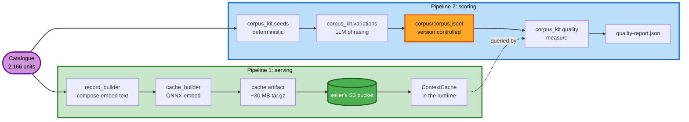
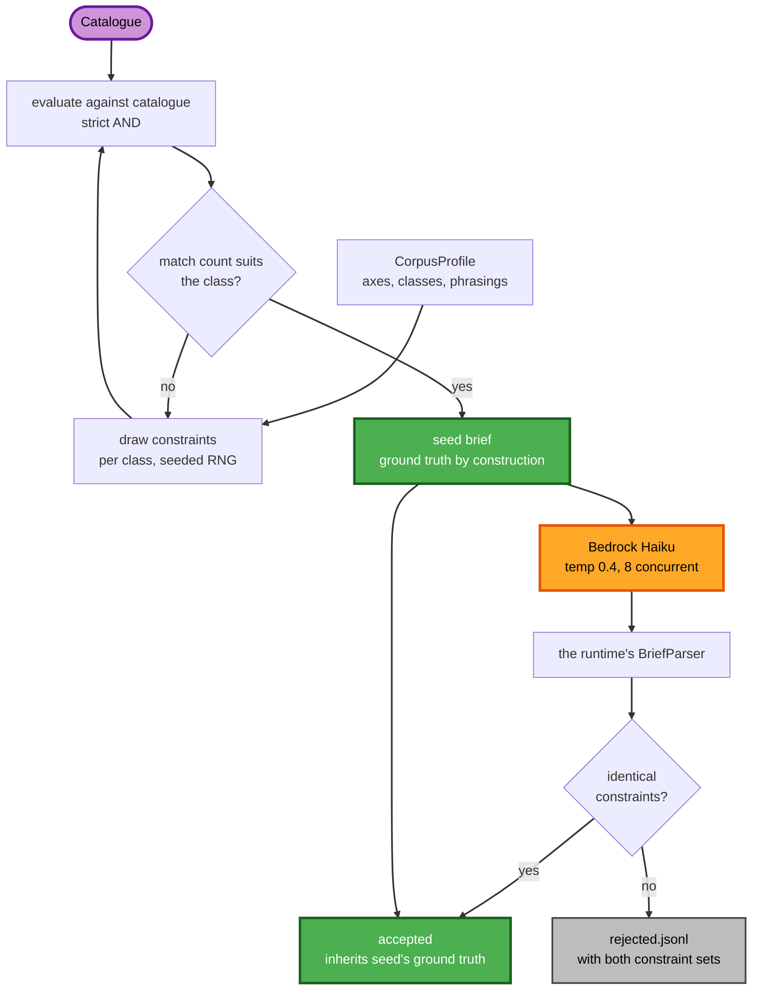
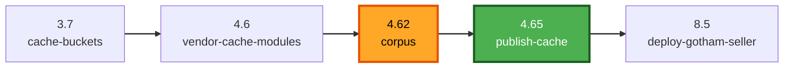

# corpus_kit — offline tooling for sellers outside this repository

> ## ⚠️ Nothing in this repository uses this package
>
> `corpus_kit` scores the retrieval quality of a seller that answers `get_products` from an embedding
> index. The only seller here — `agents/seller/reference-seller` — deliberately has no index: it matches
> five hand-authored fixtures by keyword overlap, so there is no ranking to measure. See that seller's
> README, "No corpus, no cache, no ranking — deliberately".
>
> Concretely, as of this repository's contents:
>
> - No module here imports `corpus_kit`. Its consumers are the `poseidon-seller` and `gotham-seller`
>   trees, which are **not part of this repository**.
> - `deploy_all.py`'s `CORPUS_SELLER_DIRS` names only `gotham-seller/app/gotham_corpus/`, and the step
>   that drives it — **4.62 `corpus`** — is commented out of `STEPS`, along with 3.7 `cache-buckets`,
>   4.6 `vendor-cache-modules` and 4.65 `publish-cache`.
> - Every path, seller name and file reference below therefore describes a tree you do not have. The
>   Gotham and Poseidon examples are retained because they are the only worked examples of this
>   tooling in use, not because you can run them here.
>
> It is kept as the reference implementation for anyone building a ranking seller against the AdCP
> reference seller. Read it as design documentation. Do not expect the commands to run.

A benchmark corpus is a set of buyer briefs paired with the exact set of products that satisfies each one.
It exists to measure a seller's retrieval quality. This package generates the briefs, computes their
ground truth from the catalogue, optionally rewords them through an LLM, and scores a live cache artifact
against the result.

## Contents

| Module | Responsibility |
|---|---|
| `profile.py` | `CorpusProfile` — the per-seller recipe: brief classes, attribute axes, phrasings |
| `seeds.py` | Deterministic seed briefs; ground truth computed from the catalogue |
| `variations.py` | LLM rewording, and the validator that decides which rewordings are usable |
| `quality.py` | The metric suite and the report renderer |
| `build.py` | Two-stage build, output files, provenance record |
| `deploy.py` | Build-if-absent, verify-if-present, for use from a deploy harness |
| `corpus_types.py` | Record and report types |

## Architecture

Two pipelines are fed by the same catalogue. They share no code and no artifacts.



**Serving pipeline.** The catalogue is read by `record_builder`, which composes one text string per
inventory unit describing the fields a brief could plausibly mention. `cache_builder` embeds those strings
locally through ONNX Runtime and writes a tar.gz artifact containing the vector indexes and a SQLite
sidecar. The artifact is uploaded to the seller's S3 bucket, and the runtime's `ContextCache` loads it to
answer `get_products`.

**Scoring pipeline.** The same catalogue is read by `corpus_kit.seeds`, which draws constraint
combinations and evaluates them against the catalogue to produce briefs with known answers.
`corpus_kit.variations` rewords those briefs through Bedrock. The accepted result is written to
`corpus/corpus.jsonl` and committed. `corpus_kit.quality` replays every brief through the deployed cache
and writes `quality-report.json`.

The only connection between the two is the dashed edge: measurement queries the runtime. Nothing flows the
other way.

Two consequences follow from that, and both are load-bearing:

- **The corpus does not affect retrieval quality.** It is a marking scheme, not training data, not an
  index, and not a cache input. Enlarging it changes what is known about retrieval and changes nothing
  about how retrieval behaves.
- **The corpus is never uploaded.** It stays on disk and in version control. A retriever able to read the
  ground truth it is scored against would be marking its own work. This is why the corpus deploy step
  needs no S3 bucket, and it is the opposite of how the audio seller's corpus is handled (see
  [Relationship to the audio seller's corpus](#relationship-to-the-audio-sellers-corpus)).

## Corpus construction

The build runs in two stages. Stage one is deterministic and offline. Stage two requires Bedrock
credentials and is opt-in.



**Stage one, per brief class.** The profile supplies the attribute axes a class draws from and how many
attributes to take from each. A seeded random stream picks attributes and values, using only values the
catalogue actually carries. Those constraints are evaluated against every unit under a strict AND, and the
resulting match count is checked against the class: most classes require a non-empty result, and a class
declared `expects_empty` requires an empty one. A draw that fails the check is discarded and another is
taken, up to `max_draws_per_brief`. A draw that passes becomes a seed brief whose ground truth is the set
of units that just matched.

Both branches out of the seed brief matter. It is written to the corpus directly, and it is also sent to
stage two.

**Stage two, per seed.** The brief's text is sent to Bedrock with an instruction to reword it several ways.
Each reworded string is parsed by the runtime's own `BriefParser` and compared to the seed's constraints.
An identical parse means the reworded brief asks the same question, so it enters the corpus carrying the
seed's ground truth, its `origin` set to `variation` and its `seed_brief_id` naming the seed. Any other
outcome is written to `rejected.jsonl` with both constraint sets and a reason code.

### Ground truth

Ground truth comes from the catalogue, never from a model. Constraints are applied to the catalogue and
whatever survives is the correct answer. There is no labelling pass. The model's only contribution is
wording, and `VariationGenerator.vary` returns `list[str]` so it is structurally unable to assign an
answer.

Ground truth is also complete rather than sampled: every unit satisfying every stated constraint, not the
top ten. This is what makes `recall@10` well defined and also what makes it ceiling-bound on briefs that
match a large share of the catalogue.

### Variation validation

A variation inherits its seed's ground truth only if the runtime's parser extracts an identical constraint
set from it. Identity, not similarity — not a subset, not a superset.

The failure this prevents is common. A reworded brief that turns `under $14 CPM` into `affordable` has
dropped a constraint, making it a broader request whose correct answer set is strictly larger than the
seed's. Inheriting the seed's narrower answer would mark correct results as wrong, recall would fall, and
the natural reading of that fall — that retrieval regressed — would be the opposite of what happened.

Using the runtime's parser rather than a reimplementation is deliberate. Two implementations of "what does
this brief ask for" will eventually disagree, and the disagreement surfaces as a quality figure. A prior
instance of exactly this cost a measurement: a parser emitting `group_name` scored against a corpus naming
the dimension `group` reported filter precision of 0.0000 across 4,406 constraints while extracting every
one of them correctly.

Rejection rates are expected to be high. Gotham's build offered 4,000 rewordings and accepted 2,160; the
1,840 rejections are the validator working, not the model failing.

## Deployment integration

`deploy_all.py` step 4.62 (`corpus`) builds or verifies each seller's corpus.



The corpus step is placed after the cache buckets exist and the shared runtime modules have been vendored,
and before `publish-cache` builds and uploads the artifact. That ordering means the corpus that scores an
artifact is present and verified before the artifact is produced. The seller runtime deploys afterwards.

Step 4.62 requires no AWS credentials to verify and no S3 bucket at all.

In normal operation it builds nothing. The corpus is committed, so a clone already has it and the step
only verifies. The build path exists for a new seller, or for a corpus deliberately deleted to start a new
baseline; it is behind `--apply` because it costs one Bedrock call per seed.

### Verification checks

| Check | Detects | Failure mode without the check |
|---|---|---|
| The corpus parses | truncation, partial checkout | Immediate: fails on the line it was cut at |
| Digest matches `provenance.json` | hand-edit, bad merge | Silent: fewer or altered cases, no error raised |
| Catalogue fingerprint matches | the catalogue changed | Silent, and produces plausible numbers |

The third check has no equivalent in the audio seller's corpus gate, which verifies bytes only. It matters
more here because the dependency is stronger. An artifact rebuilt against a changed catalogue is simply a
new artifact. A corpus rebuilt against a changed catalogue is a new baseline, and until it is rebuilt every
expected product id in it refers to inventory that may no longer exist — while the file still parses and
still hashes correctly.

A verification failure raises `CorpusNotVerified` and stops. It never triggers a rebuild. Rebuilding would
replace the only copy of the ground truth that recorded figures refer to rather than restore it, which is
how a bad merge becomes an undetected new baseline. Recovery is a human decision: restore from version
control, or rebuild deliberately and re-measure.

## Interpreting the report

```
class                          cases   recall    achv     MRR  filter  empty    |GT|
audience_led                     624   0.2900  0.9365  0.9391  1.0000 0.0609    99.1
aggregate                       3160   0.3743  0.9764  0.9778  0.9984 0.2038    66.1
```

| Column | Definition | What it answers |
|---|---|---|
| `recall` | found / \|ground truth\| | How much of the matching inventory fits in the result window |
| `achv` | found / min(10, \|ground truth\|) | Whether retrieval filled the slots it could have filled |
| `MRR` | mean reciprocal rank of the first correct result | Whether correct results are ranked usefully |
| `filter` | all returned units honour all stated constraints | Whether excluded inventory is being returned |
| `empty` | share of briefs returning nothing | Behaviour on briefs that should match nothing |
| `\|GT\|` | mean ground-truth size | Whether `recall` was ceiling-bound |

`recall` and `achv` answer different questions, and the gap between them is informative rather than a
discrepancy. A brief that legitimately matches 99 units caps classic `recall@10` at 0.10 for a perfect
retriever, so a low aggregate is often arithmetic. Read `achv` for whether retrieval is working.

`filter` sits near 1.0 by construction, because the candidate filter is a hard AND in SQL. It is a
regression detector rather than a figure that varies meaningfully.

`empty` earns its place on the empty-expecting class. A retriever that never returns nothing would score
well on recall while being wrong about every brief that should match nothing.

### The baseline comparison

One class is measured twice: once normally, and once with the second vector axis withheld by passing
`audience_weight=0.0` through the same filter, ranker and artifact. The delta is reported.

A zero delta does not establish that the axis is inert. Gotham's came back `+0.0000` on all three figures
while the two rankings differed for every brief tested: `achv` and `MRR` were already at 1.0000 and mean
ground truth was 99 units against 10 slots, so any correct ten score identically. The delta measures the
metrics' remaining headroom as much as it measures the axis. `render_report` prints this caveat when it
detects the condition, because the figure has been misread once.

## Adding a new seller

Three pieces are seller-specific. Everything else is in this package.

1. A `CorpusProfile` — brief classes, the attribute axes each class draws from, and one phrasing template
   per attribute.
2. A catalogue adapter — one inventory unit to a `CatalogueUnit(product_id, values, price)`, where `values`
   maps attribute names to a single value or a tuple of them.
3. A thin CLI — load the catalogue, construct the runtime's `BriefParser`, call `build.build`.

`agents/seller/gotham-seller/app/gotham_corpus/` is the reference implementation. `corpus_profile.py`
covers items 1 and 2 in about 150 lines; `build_corpus.py` and `deploy_corpus.py` cover item 3.

Register the new directory in `CORPUS_SELLER_DIRS` in `deploy_all.py` and step 4.62 will cover it.

The four class names Gotham uses (`audience_led`, `content_led`, `blended`, `negative`) are exported as
`CONVENTIONAL_BRIEF_CLASSES` rather than required. Reusing them keeps two sellers' corpora comparable;
defining different ones is supported.

## Implementation constraints

**The profile is a reproducibility contract.** Class order determines file order. Draw order within a class
determines the order of consumption from the random stream. Reordering either rewrites the corpus without
changing any brief's content, invalidating every digest recorded against it.
`gotham_corpus/tests/test_tracked_corpus.py` guards this by rebuilding the seeds and comparing them to the
committed file byte for byte.

**`budget="floor"` does not consume the random stream.** Expressing it as `probabilistic` with probability
1.0 would consume a draw and shift every subsequent brief in that class. This is why `BudgetRule` has three
values rather than two.

**A throttled Bedrock call leaves no record in `rejected.jsonl`.** `VariationGenerator.vary` swallows
failures by design, so that one throttled call does not end a build. The only signature of a lost call is
`variations_offered` falling short of `seeds × variations`, which `BuildResult.lost_calls` computes and the
build reports.

**Seeds are reproducible; the corpus is not.** Stage one is deterministic given a seed. Stage two samples
at temperature 0.4 with no model-side seed, so a re-run produces different wording. That asymmetry is why
the corpus is committed rather than regenerated on demand.

**The types module is `corpus_types.py`, not `types.py`.** Naming it `types.py` shadows the standard
library's `types` module as soon as the package directory is on `sys.path`, producing a circular-import
error raised from `enum` that names neither this package nor the real cause.

## Relationship to the audio seller's corpus

`poseidon-seller/app/cache_pipeline/corpus/` holds a separate, earlier corpus: 9,000 briefs, a different
schema, six categories, partial-match scoring, and a generator that no longer exists and was never
committed.

It is handled differently in one significant respect. That corpus is uploaded into the cache bucket by
`deploy_cache_corpus.py` during step 4.65, because the audio seller's pipeline gates its build stages on
the corpus being present in S3. The rule stated above — that a corpus is never uploaded — applies to
corpora built with this package.

`poseidon-seller/app/cache_pipeline/corpus/README.md` is worth reading before building any corpus. It is
a detailed record of what went wrong during that build.

## Running the tests

```sh
# from the repo root, with any interpreter that has pytest
agents/seller/poseidon-seller/app/adcpPoseidonSeller/.venv/bin/python \
    -m pytest agents/seller/_shared/corpus_kit/tests -q
```

No AWS credentials, no network, and no catalogue required: the fixtures supply a ten-unit synthetic
catalogue and a stub parser.
